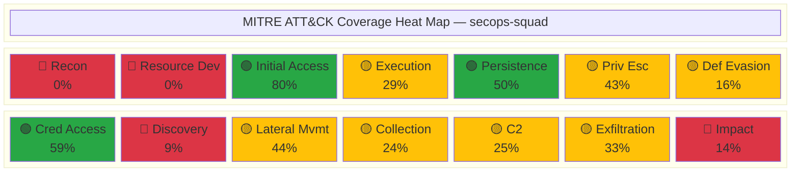

# MITRE ATT&CK Coverage Map

> **Generated:** 2026-04-28 | **Skills Scanned:** 52 | **Framework:** MITRE ATT&CK Enterprise v15
>
> This document maps every secops-squad skill to the MITRE ATT&CK techniques it covers,
> identifies gaps, and provides actionable recommendations for closing them.

---

## Coverage Summary

| Tactic | ID | Techniques Covered | Total in ATT&CK | Coverage % | Rating |
|---|---|---|---|---|---|
| Reconnaissance | TA0043 | 0 | 18 | 0% | 🔴 None |
| Resource Development | TA0042 | 0 | 8 | 0% | 🔴 None |
| Initial Access | TA0001 | 8 | 10 | 80% | 🟢 High |
| Execution | TA0002 | 4 | 14 | 29% | 🟡 Low |
| Persistence | TA0003 | 10 | 20 | 50% | 🟢 Medium |
| Privilege Escalation | TA0004 | 6 | 14 | 43% | 🟡 Medium |
| Defense Evasion | TA0005 | 7 | 43 | 16% | 🟡 Low |
| Credential Access | TA0006 | 10 | 17 | 59% | 🟢 High |
| Discovery | TA0007 | 3 | 32 | 9% | 🔴 Low |
| Lateral Movement | TA0008 | 4 | 9 | 44% | 🟡 Medium |
| Collection | TA0009 | 4 | 17 | 24% | 🟡 Low |
| Command and Control | TA0011 | 4 | 16 | 25% | 🟡 Low |
| Exfiltration | TA0010 | 3 | 9 | 33% | 🟡 Medium |
| Impact | TA0040 | 2 | 14 | 14% | 🔴 Low |

**Overall: 48 unique techniques covered across 52 skills (20% of Enterprise ATT&CK)**

---

## Coverage by Skill Category

| Category | Skills | Unique Techniques | Primary Tactic Areas |
|---|---|---|---|
| kql | 10 | 17 | Credential Access, Initial Access, C2, Lateral Movement |
| detection | 8 | 21 | Initial Access, Credential Access, Persistence |
| msft-security | 8 | 31 | Credential Access, Persistence, Defense Evasion, Exfiltration |
| soar | 10 | 16 | Initial Access, Credential Access, Exfiltration |
| adx | 8 | 4 | C2, Credential Access, Exfiltration |
| log-analytics | 8 | 1 | Persistence (T1078 only) |

---

## Detailed Technique Matrix

### TA0001 — Initial Access (80% coverage)

| Technique ID | Technique Name | Covered By Skills | Detection Type |
|---|---|---|---|
| T1078 | Valid Accounts | 29 skills across all categories | Behavioral + Rule-based |
| T1078.002 | Valid Accounts: Domain Accounts | detection/nrt-rule-pattern | NRT Rule |
| T1078.004 | Valid Accounts: Cloud Accounts | detection/threat-model-template, detection/watchlist-driven-detection, soar/compromised-account | Watchlist + SOAR |
| T1566 | Phishing | 8 skills (detection, kql, msft-security) | Scheduled + NRT |
| T1566.001 | Spearphishing Attachment | detection/detection-lifecycle, detection/mitre-attack-mapping, detection/threat-model-template, soar/phishing-response | Scheduled + SOAR |
| T1566.002 | Spearphishing Link | detection/threat-model-template, soar/phishing-response | Threat Model + SOAR |
| T1190 | Exploit Public-Facing Application | detection/nrt-rule-pattern, kql/cloud-security-posture, msft-security/defender-for-cloud-policies | NRT + CSPM |
| T1133 | External Remote Services | detection/detection-lifecycle, detection/nrt-rule-pattern | NRT Rule |

### TA0002 — Execution (29% coverage)

| Technique ID | Technique Name | Covered By Skills | Detection Type |
|---|---|---|---|
| T1059 | Command and Scripting Interpreter | 10 skills (kql, adx, msft-security, soar) | Behavioral + Hunting |
| T1059.001 | PowerShell | detection/mitre-attack-mapping, msft-security/defender-xdr-configuration | XDR + Detection |
| T1053 | Scheduled Task/Job | kql/defender-xdr-hunting, msft-security/defender-for-endpoint | XDR Hunting |
| T1203 | Exploitation for Client Execution | msft-security/defender-for-endpoint | EDR |

### TA0003 — Persistence (50% coverage)

| Technique ID | Technique Name | Covered By Skills | Detection Type |
|---|---|---|---|
| T1078 | Valid Accounts | 29 skills across all categories | Behavioral + Rule-based |
| T1078.002 | Domain Accounts | detection/nrt-rule-pattern | NRT Rule |
| T1078.004 | Cloud Accounts | detection/threat-model-template, detection/watchlist-driven-detection, soar/compromised-account | Watchlist + SOAR |
| T1098 | Account Manipulation | kql/sentinel-analytics-rules, kql/ueba-patterns, soar/sentinel-enrichment-user | UEBA + Analytics |
| T1133 | External Remote Services | detection/detection-lifecycle, detection/nrt-rule-pattern | NRT Rule |
| T1136 | Create Account | soar/sentinel-enrichment-user | SOAR Enrichment |
| T1525 | Implant Internal Image | msft-security/defender-for-cloud-policies | CSPM |
| T1547 | Boot or Logon Autostart Execution | msft-security/defender-for-endpoint | EDR |
| T1553 | Scheduled Task/Job | kql/defender-xdr-hunting, msft-security/defender-for-endpoint | XDR Hunting |
| T1556 | Modify Authentication Process | kql/entra-signin-analysis, msft-security/entra-id-protection | Identity Protection |

### TA0004 — Privilege Escalation (43% coverage)

| Technique ID | Technique Name | Covered By Skills | Detection Type |
|---|---|---|---|
| T1078 | Valid Accounts | 29 skills | Behavioral + Rule-based |
| T1078.002 | Domain Accounts | detection/nrt-rule-pattern | NRT Rule |
| T1078.004 | Cloud Accounts | 3 skills (detection, soar) | Watchlist + SOAR |
| T1053 | Scheduled Task/Job | kql/defender-xdr-hunting, msft-security/defender-for-endpoint | XDR Hunting |
| T1098 | Account Manipulation | kql/sentinel-analytics-rules, kql/ueba-patterns, soar/sentinel-enrichment-user | UEBA |
| T1547 | Boot or Logon Autostart Execution | msft-security/defender-for-endpoint | EDR |

### TA0005 — Defense Evasion (16% coverage)

| Technique ID | Technique Name | Covered By Skills | Detection Type |
|---|---|---|---|
| T1027 | Obfuscated Files or Information | detection/fusion-rule-context, kql/adx-integration | Fusion ML + KQL |
| T1078 | Valid Accounts | 29 skills | Behavioral |
| T1078.002 | Domain Accounts | detection/nrt-rule-pattern | NRT Rule |
| T1078.004 | Cloud Accounts | 3 skills | Watchlist |
| T1550.002 | Pass the Hash | msft-security/defender-for-identity | MDI |
| T1556 | Modify Authentication Process | kql/entra-signin-analysis, msft-security/entra-id-protection | Identity Protection |
| T1562 | Impair Defenses | kql/cloud-security-posture | KQL Hunting |

### TA0006 — Credential Access (59% coverage)

| Technique ID | Technique Name | Covered By Skills | Detection Type |
|---|---|---|---|
| T1003 | OS Credential Dumping | detection/mitre-attack-mapping, msft-security/defender-for-identity | MDI + Detection |
| T1003.006 | DCSync | msft-security/defender-for-identity | MDI |
| T1056.004 | Credential API Hooking | detection/threat-model-template | Threat Model |
| T1110 | Brute Force | 9 skills (detection, kql, msft-security, soar) | Analytics + SOAR |
| T1110.003 | Password Spraying | 5 skills (detection, msft-security, soar) | Analytics + SOAR |
| T1539 | Steal Web Session Cookie | detection/threat-model-template, msft-security/entra-id-protection | Identity Protection |
| T1556 | Modify Authentication Process | kql/entra-signin-analysis, msft-security/entra-id-protection | Identity Protection |
| T1558 | Steal or Forge Kerberos Tickets | msft-security/defender-for-identity | MDI |
| T1558.001 | Golden Ticket | msft-security/defender-for-identity | MDI |
| T1558.003 | Kerberoasting | msft-security/defender-for-identity | MDI |

### TA0007 — Discovery (9% coverage)

| Technique ID | Technique Name | Covered By Skills | Detection Type |
|---|---|---|---|
| T1087 | Account Discovery | kql/ueba-patterns, msft-security/defender-for-identity | UEBA + MDI |
| T1087.001 | Local Account | msft-security/defender-for-identity | MDI |
| T1087.002 | Domain Account | msft-security/defender-for-identity | MDI |

### TA0008 — Lateral Movement (44% coverage)

| Technique ID | Technique Name | Covered By Skills | Detection Type |
|---|---|---|---|
| T1021 | Remote Services | detection/mitre-attack-mapping, kql/cross-workspace-queries, kql/incident-investigation | KQL Hunting |
| T1021.001 | Remote Desktop Protocol | kql/incident-investigation | KQL Hunting |
| T1021.006 | Windows Remote Management | kql/incident-investigation | KQL Hunting |
| T1550.002 | Pass the Hash | msft-security/defender-for-identity | MDI |

### TA0009 — Collection (24% coverage)

| Technique ID | Technique Name | Covered By Skills | Detection Type |
|---|---|---|---|
| T1056.004 | Credential API Hooking | detection/threat-model-template | Threat Model |
| T1114 | Email Collection | detection/threat-model-template, msft-security/purview-dlp-patterns | DLP + Detection |
| T1114.003 | Email Forwarding Rule | detection/threat-model-template, msft-security/entra-id-protection | Identity + Detection |
| T1530 | Data from Cloud Storage | kql/cloud-security-posture, msft-security/defender-for-cloud-policies, msft-security/sentinel-workspace-setup | CSPM + KQL |

### TA0011 — Command and Control (25% coverage)

| Technique ID | Technique Name | Covered By Skills | Detection Type |
|---|---|---|---|
| T1071 | Application Layer Protocol | 11 skills (adx, detection, kql, soar) | Behavioral + ML |
| T1090 | Proxy | msft-security/entra-id-protection, soar/sentinel-enrichment-ip | Enrichment |
| T1105 | Ingress Tool Transfer | soar/sentinel-enrichment-ip | TI Enrichment |
| T1573 | Encrypted Channel | soar/sentinel-enrichment-ip | TI Enrichment |

### TA0010 — Exfiltration (33% coverage)

| Technique ID | Technique Name | Covered By Skills | Detection Type |
|---|---|---|---|
| T1048 | Exfiltration Over Alternative Protocol | adx/adx-ml-anomaly, kql/incident-investigation, msft-security/purview-dlp-patterns, soar/data-exfiltration-response | DLP + ML + SOAR |
| T1537 | Transfer Data to Cloud Account | msft-security/purview-dlp-patterns | DLP |
| T1567 | Exfiltration Over Web Service | msft-security/purview-dlp-patterns, soar/data-exfiltration-response | DLP + SOAR |

### TA0040 — Impact (14% coverage)

| Technique ID | Technique Name | Covered By Skills | Detection Type |
|---|---|---|---|
| T1486 | Data Encrypted for Impact | detection/fusion-rule-context, msft-security/defender-xdr-configuration, soar/malware-containment | Fusion + XDR + SOAR |
| T1565.001 | Stored Data Manipulation | msft-security/purview-dlp-patterns | DLP |

---

## Coverage Gaps Analysis

### Critical Missing Techniques (Top 20 Most Common)

Of the 20 most commonly observed ATT&CK techniques in real-world attacks, we cover **7** and are missing **13**:

| Technique ID | Technique Name | Tactic | Recommended Skill | Priority |
|---|---|---|---|---|
| T1055 | Process Injection | Defense Evasion, Priv Esc | `detection/process-injection-detection.md` | 🔴 Critical |
| T1036 | Masquerading | Defense Evasion | `detection/defense-evasion-patterns.md` | 🔴 Critical |
| T1204 | User Execution | Execution | `detection/user-execution-detection.md` | 🔴 Critical |
| T1218 | System Binary Proxy Execution | Defense Evasion | `kql/lolbas-hunting.md` | 🔴 Critical |
| T1070 | Indicator Removal | Defense Evasion | `detection/anti-forensics-detection.md` | 🟡 High |
| T1047 | Windows Management Instrumentation | Execution | `kql/wmi-hunting.md` | 🟡 High |
| T1134 | Access Token Manipulation | Priv Esc, Defense Evasion | `detection/token-manipulation-detection.md` | 🟡 High |
| T1068 | Exploitation for Privilege Escalation | Privilege Escalation | `msft-security/defender-vuln-mgmt.md` | 🟡 High |
| T1518 | Software Discovery | Discovery | `kql/discovery-technique-hunting.md` | 🟡 Medium |
| T1082 | System Information Discovery | Discovery | `kql/discovery-technique-hunting.md` | 🟡 Medium |
| T1016 | System Network Config Discovery | Discovery | `kql/discovery-technique-hunting.md` | 🟡 Medium |
| T1033 | System Owner/User Discovery | Discovery | `kql/discovery-technique-hunting.md` | 🟡 Medium |
| T1497 | Virtualization/Sandbox Evasion | Defense Evasion, Discovery | `detection/sandbox-evasion-detection.md` | 🟡 Medium |

### Weakest Tactic Areas

1. **Reconnaissance (0%)** — Expected gap; pre-compromise activity is mostly external. Microsoft Defender Threat Intelligence and EASM could address some of these.
2. **Resource Development (0%)** — Also pre-compromise. Limited detection surface. Threat Intelligence feeds (covered in `soar/threat-intel-ingest`) partially address this.
3. **Discovery (9%)** — Large gap. Add KQL hunting skills for common discovery commands (whoami, net user, systeminfo, nltest).
4. **Impact (14%)** — Need skills for resource hijacking (T1496), service stop (T1489), and defacement (T1491).

### Recommended New Skills (Priority Order)

1. **`kql/lolbas-hunting.md`** — Living-off-the-Land binary hunting (covers T1218, T1036, T1202)
2. **`detection/process-injection-detection.md`** — Process injection patterns (T1055 and sub-techniques)
3. **`kql/discovery-technique-hunting.md`** — Discovery tactic hunting (T1082, T1016, T1033, T1518, T1069)
4. **`detection/defense-evasion-patterns.md`** — Defense evasion catch-all (T1036, T1070, T1134)
5. **`detection/user-execution-detection.md`** — User execution + social engineering (T1204)

---

## Coverage by Microsoft Security Product

| Product | Techniques Covered | Primary Tactic Areas | Key Skills |
|---|---|---|---|
| Microsoft Sentinel | 35+ | All covered tactics | All detection/, most kql/ |
| Defender for Endpoint | T1059, T1203, T1053, T1547 | Execution, Persistence | defender-for-endpoint |
| Defender for Identity | T1078, T1087, T1003, T1558, T1550 | Credential Access, Discovery, Lateral Movement | defender-for-identity |
| Defender XDR | T1566, T1078, T1059, T1486 | Initial Access, Execution, Impact | defender-xdr-configuration |
| Entra ID Protection | T1078, T1110, T1556, T1539, T1090 | Credential Access, Initial Access | entra-id-protection |
| Defender for Cloud | T1530, T1078, T1190, T1525 | Initial Access, Persistence, Collection | defender-for-cloud-policies |
| Microsoft Purview | T1567, T1048, T1537, T1114, T1565 | Exfiltration, Collection, Impact | purview-dlp-patterns |
| Graph Security API | T1059, T1078 | Execution, Initial Access | microsoft-graph-security |

---

## Coverage Heat Map



### Legend

- 🟢 **High** (≥50%) — Strong coverage, continue iterating
- 🟡 **Medium** (15–49%) — Partial coverage, prioritize gaps
- 🔴 **Low/None** (<15%) — Critical gaps, immediate attention needed

---

## Skill-to-Technique Cross-Reference

### Most-Referenced Techniques

| Technique | # Skills | Categories |
|---|---|---|
| T1078 — Valid Accounts | 29 | all 6 categories |
| T1071 — Application Layer Protocol | 11 | adx, detection, kql, soar |
| T1059 — Command and Scripting Interpreter | 10 | adx, kql, msft-security, soar |
| T1110 — Brute Force | 9 | detection, kql, msft-security, soar |
| T1566 — Phishing | 8 | detection, kql, msft-security |
| T1110.003 — Password Spraying | 5 | detection, msft-security, soar |
| T1048 — Exfiltration Over Alt Protocol | 4 | adx, kql, msft-security, soar |

### Skills with Zero MITRE Coverage

These skills are infrastructure/operational and don't map to ATT&CK techniques:

| Skill | Category | Reason |
|---|---|---|
| workspace-architecture | log-analytics | Infrastructure planning |
| retention-archive | log-analytics | Data lifecycle management |
| purge-and-export | log-analytics | Data operations |
| diagnostic-settings | log-analytics | Monitoring configuration |
| data-connectors-setup | log-analytics | Data ingestion plumbing |
| custom-tables-dcr | log-analytics | Schema engineering |
| cost-optimization | log-analytics | FinOps |
| migration-from-sentinel | adx | Data migration |
| long-term-retention | adx | Storage architecture |
| data-ingestion | adx | Pipeline engineering |
| cluster-architecture | adx | Infrastructure |
| adx-dashboards | adx | Visualization |
| ticket-create | soar | ITSM integration |
| threat-intel-ingest | soar | TI pipeline |
| teams-notification | soar | Notification routing |
| auto-triage | soar | Incident routing |

---

## Usage

Run the coverage scanner programmatically:

```javascript
const { scanSkills, buildCoverageMap, findGaps, generateReport } = require('./lib/mitre-mapping');

const skills = scanSkills('./skills');
const map = buildCoverageMap(skills);
const gaps = findGaps(map);

// Console summary
console.log(generateReport(map, 'summary'));

// JSON export
console.log(generateReport(map, 'json'));
```

Or via CLI (when implemented):

```bash
secops-squad mitre coverage          # summary view
secops-squad mitre coverage --json   # machine-readable
secops-squad mitre gaps              # gap analysis
```
