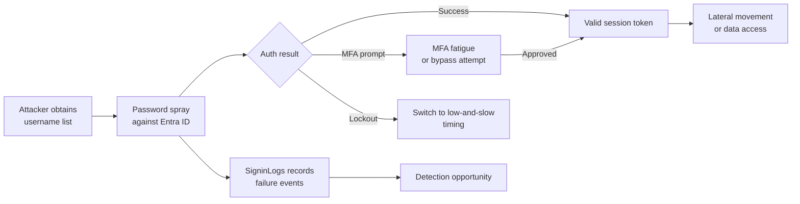
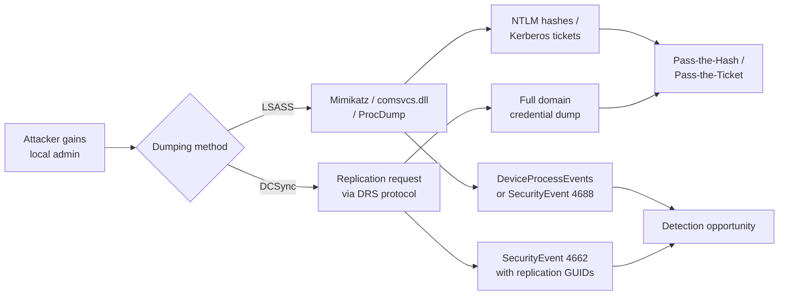
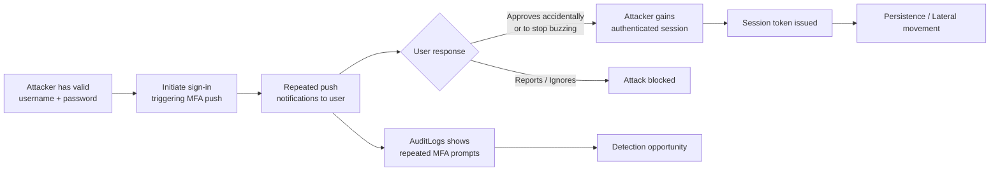
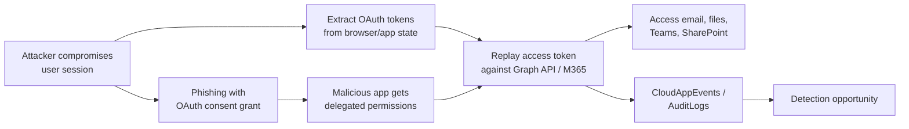
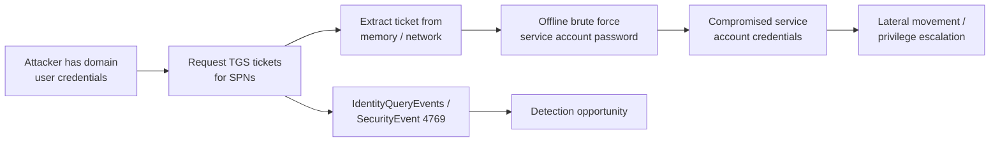

# Threat Model: Credential Access (TA0006)

## Executive Summary

Credential Access is where attackers get keys to the kingdom. In Microsoft 365 / Azure / hybrid environments, this tactic covers everything from brute-forcing Entra ID accounts to dumping LSASS on endpoints to stealing OAuth tokens. A compromised credential bypasses every perimeter control — it's the most common precursor to lateral movement, privilege escalation, and data exfiltration. Our detection stack must cover cloud-native (Entra ID), endpoint (LSASS/SAM), and hybrid (Kerberos) credential attacks.

---

## Technique: T1110 — Brute Force

### Sub-techniques covered
- T1110.001 — Password Guessing
- T1110.003 — Password Spraying

### Attack Flow



### Data Sources

| MITRE Data Source | Microsoft Table | Connector Required | Notes |
|---|---|---|---|
| Logon Session | `SigninLogs` | Entra ID connector (Diagnostic Settings) | Captures interactive sign-ins with ResultType codes |
| Logon Session | `AADNonInteractiveUserSignInLogs` | Entra ID connector | Service principal and app-based auth |
| User Account Authentication | `IdentityLogonEvents` | Defender for Identity | Covers on-prem AD authentication |
| Application Log | `CloudAppEvents` | Defender for Cloud Apps | OAuth and app consent flows |

### Detection Opportunities

**Opportunity 1: Password spray detection — multiple accounts, same password pattern**

Detection point: Failed sign-in clustering across accounts from common IPs.

```kql
// Password spray: many users failing from few IPs in short window
SigninLogs
| where TimeGenerated > ago(1h)
| where ResultType in ("50126", "50053", "50055") // Invalid password, locked, expired
| summarize
    FailedUsers = dcount(UserPrincipalName),
    FailedAttempts = count(),
    Users = make_set(UserPrincipalName, 25)
    by IPAddress, bin(TimeGenerated, 10m)
| where FailedUsers > 10
| where FailedAttempts > 20
```

**Opportunity 2: Brute force against single account**

```kql
// Single account brute force: high failure count then success
let threshold = 15;
SigninLogs
| where TimeGenerated > ago(1h)
| summarize
    Failures = countif(ResultType != "0"),
    Successes = countif(ResultType == "0"),
    DistinctIPs = dcount(IPAddress)
    by UserPrincipalName, bin(TimeGenerated, 30m)
| where Failures > threshold and Successes > 0
```

**Opportunity 3: Distributed brute force via residential proxies**

```kql
// Distributed spray: many IPs targeting same org, low per-IP count
SigninLogs
| where ResultType == "50126"
| summarize AttemptCount = count() by IPAddress
| where AttemptCount between (1 .. 3)
| summarize SuspiciousIPs = count()
| where SuspiciousIPs > 50
```

### False Positive Scenarios

| Scenario | Cause | Tuning Approach |
|---|---|---|
| Help desk password resets | Multiple failures during assisted reset | Exclude help desk IP ranges or correlate with ServiceDesk ticket system |
| VPN concentrator IPs | Many users auth from same IP | Use `NetworkLocationDetails` to identify corporate egress IPs; add to allowlist |
| Automated scanners | Security tools testing account lockout | Exclude scanner service principal IDs |
| Migration events | Bulk credential validation during tenant migration | Time-bound suppression with change ticket reference |

### Microsoft Product Coverage

| Product | Coverage Type | Feature | Limitations |
|---|---|---|---|
| Entra ID Protection | Detection | Sign-in risk: Password spray detection (ML-based) | Requires P2 license; limited visibility into distributed low-and-slow attacks |
| Defender for Identity | Detection | Brute force / password spray alerts | Only covers on-prem AD auth via DC sensors |
| Sentinel | Detection | Scheduled analytics rules on SigninLogs | Requires custom rules; no built-in spray detection tuned to environment |
| Defender for Cloud Apps | Detection | Impossible travel, anomalous sign-in | Detects post-compromise anomalies, not the spray itself |

### Detection Gap Analysis

**Gaps:**
- **Distributed low-and-slow sprays** — 1-2 attempts per IP across residential proxies evade threshold-based detection. Entra ID Protection's ML helps but isn't foolproof.
- **Legacy authentication bypass** — IMAP/SMTP/POP spray bypasses Conditional Access MFA. Must block legacy auth entirely.
- **Service principal brute force** — App credential attacks don't appear in `SigninLogs`; check `AADServicePrincipalSignInLogs`.
- **Federated identity spray** — Attacks targeting on-prem ADFS may not generate Entra ID sign-in events.

**Compensating Controls:**
- Block legacy authentication via Conditional Access (eliminates the largest gap)
- Enable Smart Lockout in Entra ID (adaptive lockout thresholds)
- Deploy Defender for Identity sensors on all DCs for on-prem coverage
- Implement named locations and enforce location-based Conditional Access

### Related Skills

- `skills/detection/scheduled-rule-pattern.md` — Implement the KQL stubs above as scheduled rules
- `skills/msft-security/entra-id-protection.md` — Configure sign-in risk policies for spray detection
- `skills/msft-security/defender-for-identity.md` — DC sensor deployment for on-prem brute force coverage
- `skills/detection/watchlist-driven-detection.md` — VIP account monitoring for targeted attacks

---

## Technique: T1003 — OS Credential Dumping

### Sub-techniques covered
- T1003.001 — LSASS Memory
- T1003.006 — DCSync

### Attack Flow



### Data Sources

| MITRE Data Source | Microsoft Table | Connector Required | Notes |
|---|---|---|---|
| Process Creation | `DeviceProcessEvents` | Defender for Endpoint | Captures process command lines |
| OS API Execution | `DeviceEvents` | Defender for Endpoint | LSASS access events (action: `OpenProcess`) |
| Active Directory | `SecurityEvent` | Windows Security Events connector | Event IDs 4662, 4624, 4672 |
| AD Replication | `IdentityDirectoryEvents` | Defender for Identity | DCSync detection via directory service replication |

### Detection Opportunities

**Opportunity 1: LSASS access by non-system processes**

```kql
// LSASS memory access — non-standard processes touching lsass.exe
DeviceEvents
| where ActionType == "OpenProcessApiCall"
| where TargetProcessName == "lsass.exe"
| where InitiatingProcessName !in ("csrss.exe", "svchost.exe", "wininit.exe", "MsMpEng.exe")
| project TimeGenerated, DeviceName, InitiatingProcessName, InitiatingProcessCommandLine
```

**Opportunity 2: DCSync replication request from non-DC**

```kql
// DCSync: DS-Replication-Get-Changes-All from non-domain-controller
SecurityEvent
| where EventID == 4662
| where Properties has "1131f6ad-9c07-11d1-f79f-00c04fc2dcd2" // DS-Replication-Get-Changes-All
| where SubjectUserName !endswith "$" // Filter out machine accounts (DCs)
| project TimeGenerated, Computer, SubjectUserName, ObjectName
```

**Opportunity 3: Known credential dumping tools**

```kql
// Process creation matching known dumping tools
DeviceProcessEvents
| where FileName in~ ("mimikatz.exe", "procdump.exe", "nanodump.exe")
    or ProcessCommandLine has_any ("sekurlsa", "lsadump", "-ma lsass", "comsvcs.dll,MiniDump")
```

### False Positive Scenarios

| Scenario | Cause | Tuning Approach |
|---|---|---|
| Antivirus scanning LSASS | AV engines inspect LSASS memory | Allowlist AV process names in LSASS access rules |
| Legitimate DC replication | Domain controllers replicate normally | Filter by machine account names ending in `$` and known DC hostnames |
| Procdump for crash diagnostics | IT uses procdump for application troubleshooting | Require `-ma lsass` in command line, not just procdump execution |
| CrowdStrike/Carbon Black agents | EDR agents access LSASS for monitoring | Allowlist EDR process hashes (not just names) |

### Microsoft Product Coverage

| Product | Coverage Type | Feature | Limitations |
|---|---|---|---|
| Defender for Endpoint | Prevention & Detection | Credential Guard, ASR rules, tamper protection | Credential Guard requires HVCI-capable hardware |
| Defender for Identity | Detection | DCSync detection, LSASS alerts | Requires DC sensor; limited to AD-joined environments |
| Sentinel | Detection | Custom analytics on SecurityEvent / DeviceEvents | Requires tuning; high FP potential without allowlisting |

### Detection Gap Analysis

**Gaps:**
- **In-memory-only tools** — Tools that read LSASS without triggering OpenProcess API (e.g., direct syscalls, kernel drivers) may evade user-mode detection.
- **Living-off-the-land DCSync** — If an attacker compromises a DC machine account, replication looks normal.
- **Cloud-only accounts** — Entra ID cloud-only accounts don't have NTLM hashes on-prem; but OAuth tokens are the cloud equivalent.
- **Credential Guard bypass** — Some techniques work even with Credential Guard enabled on older OS versions.

**Compensating Controls:**
- Enable Credential Guard on all supported endpoints
- Restrict replication permissions — only DCs should have `DS-Replication-Get-Changes-All`
- Deploy ASR rule: "Block credential stealing from LSASS" (GUID: `9e6c4e1f-7d60-472f-ba1a-a39ef669e4b2`)
- Monitor for new service installations on DCs (kernel driver loading)

### Related Skills

- `skills/msft-security/defender-for-endpoint.md` — ASR rules and Credential Guard configuration
- `skills/msft-security/defender-for-identity.md` — DCSync detection tuning
- `skills/detection/nrt-rule-pattern.md` — LSASS access should be NRT (near-real-time) detection

---

## Technique: T1621 — Multi-Factor Authentication Request Generation (MFA Fatigue)

### Attack Flow



### Data Sources

| MITRE Data Source | Microsoft Table | Connector Required | Notes |
|---|---|---|---|
| Logon Session | `SigninLogs` | Entra ID connector | MFA result details in `AuthenticationDetails` |
| User Account Authentication | `AuditLogs` | Entra ID connector | MFA registration and method changes |
| Application Log | `AADNonInteractiveUserSignInLogs` | Entra ID connector | Token refresh events post-compromise |

### Detection Opportunities

**Opportunity 1: Repeated MFA denials followed by approval**

```kql
// MFA fatigue: multiple denials then success for same user
SigninLogs
| where TimeGenerated > ago(2h)
| extend MFAResult = tostring(parse_json(AuthenticationDetails)[1].authenticationStepResultDetail)
| summarize
    Denials = countif(MFAResult == "MFA denied; user declined the authentication"),
    Approvals = countif(MFAResult == "MFA completed in Azure AD" or ResultType == "0")
    by UserPrincipalName, IPAddress, bin(TimeGenerated, 30m)
| where Denials >= 5 and Approvals > 0
```

**Opportunity 2: MFA prompt volume anomaly**

```kql
// Abnormal MFA prompt count for a user (baseline comparison)
SigninLogs
| where AuthenticationRequirement == "multiFactorAuthentication"
| summarize PromptCount = count() by UserPrincipalName, bin(TimeGenerated, 1h)
| where PromptCount > 10
```

### False Positive Scenarios

| Scenario | Cause | Tuning Approach |
|---|---|---|
| User switching devices | Multiple legitimate sign-ins from new devices | Correlate with `DeviceDetail` — same device means likely FP |
| Shared accounts | Multiple people authenticating as same identity | Flag shared accounts separately; shared accounts shouldn't exist |
| Authenticator app issues | User can't complete MFA due to app problems | Check if denials are "timed out" vs "user declined" |

### Microsoft Product Coverage

| Product | Coverage Type | Feature | Limitations |
|---|---|---|---|
| Entra ID Protection | Detection | Anomalous MFA activity (risk detection) | Requires P2; may lag behind real-time attacks |
| Authenticator App | Prevention | Number matching (defeats blind approval) | Only works if org has migrated to number matching |
| Conditional Access | Prevention | Authentication strength policies | Must be configured; doesn't detect, only prevents |

### Detection Gap Analysis

**Gaps:**
- **Number matching changes the pattern** — With number matching enabled, fatigue attacks shift to social engineering (e.g., calling the user with the number). Detection must evolve beyond "denial count."
- **Authenticator app vs. phone call vs. SMS** — Different MFA methods have different fatigue profiles; phone calls are more disruptive than push notifications.
- **Timing-based attacks** — Slow MFA fatigue (1 prompt every 30 minutes over a full day) evades short-window threshold detections.

**Compensating Controls:**
- Enforce number matching in Microsoft Authenticator (eliminates blind-approval fatigue)
- Enable "Report suspicious activity" in Authenticator for user self-reporting
- Deploy phishing-resistant MFA (FIDO2, Windows Hello) for privileged accounts
- Implement Conditional Access authentication strengths requiring phishing-resistant methods

### Related Skills

- `skills/msft-security/entra-id-protection.md` — Risk policies for anomalous MFA
- `skills/detection/scheduled-rule-pattern.md` — Implement MFA fatigue as a scheduled rule

---

## Technique: T1528 — Steal Application Access Token

### Attack Flow



### Data Sources

| MITRE Data Source | Microsoft Table | Connector Required | Notes |
|---|---|---|---|
| Web Credential | `CloudAppEvents` | Defender for Cloud Apps | OAuth app activity |
| Application Log | `AuditLogs` | Entra ID connector | Consent grants, app registrations |
| Logon Session | `SigninLogs` | Entra ID connector | Token-based sign-ins |
| Cloud Service | `OfficeActivity` | Office 365 connector | Mailbox and SharePoint access via token |

### Detection Opportunities

**Opportunity 1: Illicit consent grant — app with excessive permissions**

```kql
// New OAuth app consent with high-risk permissions
AuditLogs
| where OperationName == "Consent to application"
| extend AppName = tostring(TargetResources[0].displayName)
| extend Permissions = tostring(TargetResources[0].modifiedProperties[0].newValue)
| where Permissions has_any ("Mail.Read", "Mail.ReadWrite", "Files.ReadWrite.All", "User.ReadWrite.All")
```

**Opportunity 2: Token replay from anomalous location**

```kql
// Access token used from different IP than issuance
SigninLogs
| where TokenIssuerType == "AzureAD"
| where ResultType == "0"
| project TimeGenerated, UserPrincipalName, IPAddress, AppDisplayName, Location
| join kind=inner (
    SigninLogs
    | where ResultType == "0"
    | project UserPrincipalName, IPAddress2 = IPAddress, TimeGenerated2 = TimeGenerated
    | where TimeGenerated2 > ago(1h)
) on UserPrincipalName
| where IPAddress != IPAddress2
| where datetime_diff('minute', TimeGenerated, TimeGenerated2) < 10
```

### False Positive Scenarios

| Scenario | Cause | Tuning Approach |
|---|---|---|
| Legitimate SaaS app consent | Users consenting to approved apps | Maintain allowlist of approved app IDs; alert only on unknown apps |
| Mobile + desktop sign-in | Same user, different IPs due to WiFi vs cellular | Use risk score rather than raw IP comparison |
| Admin-consented apps | Tenant admin granting permissions centrally | Filter by `ConsentContext` = admin vs user consent |

### Microsoft Product Coverage

| Product | Coverage Type | Feature | Limitations |
|---|---|---|---|
| Defender for Cloud Apps | Detection | OAuth app anomaly detection | Requires Cloud App Security license |
| Entra ID Protection | Detection | Anomalous token usage risk | Detects some but not all token replay |
| Sentinel | Detection | Custom rules on AuditLogs/CloudAppEvents | Requires custom rule development |
| Conditional Access | Prevention | Token protection (preview), CAE | Token protection is limited to specific apps |

### Detection Gap Analysis

**Gaps:**
- **Token theft from endpoints** — If an attacker extracts tokens from browser cookies or token caches, replay detection depends on anomalous behavior, not the theft itself.
- **Primary Refresh Token (PRT) theft** — PRT gives persistent access; theft is hard to distinguish from normal device auth.
- **Continuous Access Evaluation (CAE) limitations** — CAE only works with supported Microsoft apps; third-party apps may honor long-lived tokens.

**Compensating Controls:**
- Enable Continuous Access Evaluation (CAE) for all supported workloads
- Deploy Conditional Access token protection policies (preview)
- Restrict user consent to verified publishers only (Entra ID > Enterprise applications)
- Monitor OAuth app activity via Defender for Cloud Apps app governance

### Related Skills

- `skills/msft-security/defender-xdr-configuration.md` — Configure Defender for Cloud Apps OAuth policies
- `skills/msft-security/entra-id-protection.md` — Token anomaly risk detections

---

## Technique: T1558 — Steal or Forge Kerberos Tickets

### Sub-techniques covered
- T1558.003 — Kerberoasting

### Attack Flow



### Data Sources

| MITRE Data Source | Microsoft Table | Connector Required | Notes |
|---|---|---|---|
| Active Directory | `SecurityEvent` | Windows Security Events | Event ID 4769 (Kerberos TGS request) |
| Active Directory | `IdentityQueryEvents` | Defender for Identity | Kerberos-related queries |
| Active Directory | `IdentityDirectoryEvents` | Defender for Identity | SPN enumeration |

### Detection Opportunities

**Opportunity 1: Kerberoasting — anomalous TGS requests**

```kql
// Kerberoasting: high volume TGS requests with RC4 encryption
SecurityEvent
| where EventID == 4769
| where TicketEncryptionType == "0x17" // RC4 encryption (weak, preferred by Kerberoasting tools)
| where ServiceName !endswith "$" // Exclude machine accounts
| summarize RequestCount = count(), Services = make_set(ServiceName, 20) by TargetUserName, IpAddress
| where RequestCount > 10
```

**Opportunity 2: Defender for Identity Kerberoast alert correlation**

```kql
// Correlate MDI Kerberoast alerts with subsequent service account usage
IdentityQueryEvents
| where ActionType == "LDAP query"
| where QueryTarget has "servicePrincipalName"
| project TimeGenerated, AccountName, DeviceName, QueryTarget
```

### False Positive Scenarios

| Scenario | Cause | Tuning Approach |
|---|---|---|
| Service account auto-renewal | Kerberos ticket rotation for services | Baseline normal TGS request patterns per account |
| IT scanning tools | Discovery tools enumerate SPNs | Allowlist IT admin accounts and scanner IPs |
| Application startup | Apps request multiple TGS tickets at boot | Correlate with known app server restart windows |

### Microsoft Product Coverage

| Product | Coverage Type | Feature | Limitations |
|---|---|---|---|
| Defender for Identity | Detection | Kerberoasting activity alert | Requires DC sensor; may miss if encryption downgrade not detected |
| Sentinel | Detection | Custom rules on SecurityEvent 4769 | Requires 4769 audit events enabled on DCs |
| Defender for Endpoint | Detection | Suspicious Kerberos activity alerts | Limited to enrolled endpoints making the requests |

### Detection Gap Analysis

**Gaps:**
- **AES Kerberoasting** — Newer tools request AES tickets (encryption type 0x12) instead of RC4, evading RC4-based detections. Must also flag anomalous volume of AES TGS requests.
- **Targeted Kerberoasting** — Requesting tickets for just 1-2 high-value SPNs won't trigger volume-based thresholds.
- **Offline cracking** — The actual password cracking happens offline; you can only detect the ticket request, not the crack.

**Compensating Controls:**
- Use Group Managed Service Accounts (gMSA) with 120+ character auto-rotating passwords
- Set service account passwords to 25+ characters minimum
- Disable RC4 encryption where possible (forces AES, makes cracking harder)
- Monitor and reduce the number of accounts with SPNs registered

### Related Skills

- `skills/msft-security/defender-for-identity.md` — Kerberoasting alert configuration and DC sensor deployment
- `skills/detection/mitre-attack-mapping.md` — Map Kerberoasting coverage to ATT&CK Navigator

---

## Coverage Matrix

| Technique ID | Technique Name | Detection Rule | Data Source Available | Coverage Level | Notes |
|---|---|---|---|---|---|
| T1110.001 | Password Guessing | Sentinel scheduled rule | ✅ SigninLogs | Partial | Single-account brute force; distributed attacks may evade |
| T1110.003 | Password Spraying | Sentinel + Entra ID Protection | ✅ SigninLogs | Partial | Low-and-slow spray remains a gap |
| T1003.001 | LSASS Memory | Defender for Endpoint ASR + NRT rule | ✅ DeviceEvents | Full | Requires ASR enabled; kernel-level bypass possible |
| T1003.006 | DCSync | Defender for Identity + Sentinel | ✅ SecurityEvent 4662 | Full | Only if DC sensors deployed |
| T1621 | MFA Fatigue | Sentinel scheduled rule | ✅ SigninLogs | Partial | Number matching defeats this; slow attacks evade |
| T1528 | Token Theft | Defender for Cloud Apps + Sentinel | ✅ AuditLogs, CloudAppEvents | Partial | PRT theft and token cache extraction hard to detect |
| T1558.003 | Kerberoasting | Defender for Identity + Sentinel | ✅ SecurityEvent 4769 | Partial | AES Kerberoasting and targeted requests may evade |

### Coverage Summary

- **Full coverage:** 2 techniques (LSASS dumping, DCSync)
- **Partial coverage:** 5 techniques (password spray, brute force, MFA fatigue, token theft, Kerberoasting)
- **No coverage:** 0 techniques
- **Highest priority gap:** T1528 (Token Theft) — OAuth token theft and PRT replay are increasingly the primary credential access vector in cloud-first environments, and detection maturity is lowest here.

---

## References

- [MITRE ATT&CK — Credential Access](https://attack.mitre.org/tactics/TA0006/)
- [Microsoft Entra ID Protection documentation](https://learn.microsoft.com/en-us/entra/id-protection/)
- [Defender for Identity Kerberoasting documentation](https://learn.microsoft.com/en-us/defender-for-identity/credential-access-alerts)
- [Token theft playbook — Microsoft Incident Response](https://learn.microsoft.com/en-us/security/operations/token-theft-playbook)

---

## Revision History

| Date | Version | Author | Changes |
|---|---|---|---|
| 2026-04-28 | 1.0 | Kima | Initial threat model — credential access tactic |
