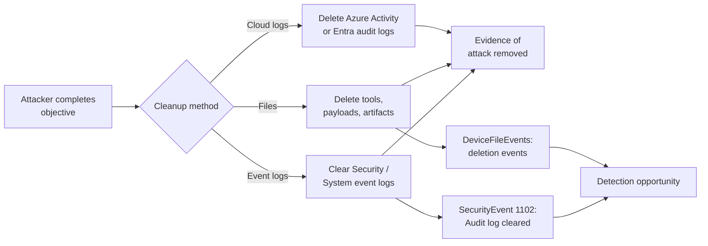
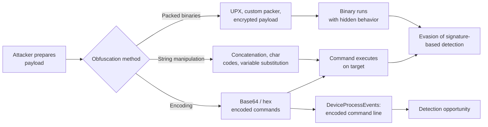
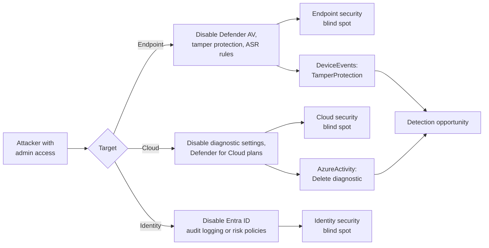
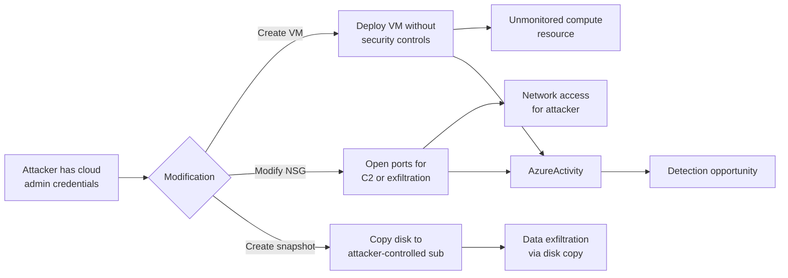

# Threat Model: Defense Evasion (TA0005)

## Executive Summary

Defense evasion is the attacker's counter to your detection stack. It encompasses clearing logs, obfuscating payloads, disabling security tools, and modifying cloud infrastructure to hide activity. In Microsoft environments, this ranges from clearing Windows Event Logs to disabling Defender for Endpoint tamper protection, to deleting Azure activity logs. Detection of evasion is inherently paradoxical — you're trying to detect the deletion of the evidence you need for detection. The key: detect the act of evasion itself, not the activity being hidden.

---

## Technique: T1070 — Indicator Removal

### Sub-techniques covered
- T1070.001 — Clear Windows Event Logs
- T1070.004 — File Deletion

### Attack Flow



### Data Sources

| MITRE Data Source | Microsoft Table | Connector Required | Notes |
|---|---|---|---|
| Windows Registry | `SecurityEvent` | Windows Security Events | Event ID 1102 (log cleared), 4688 (process creation) |
| Process Creation | `DeviceProcessEvents` | Defender for Endpoint | wevtutil.exe, Clear-EventLog usage |
| File | `DeviceFileEvents` | Defender for Endpoint | File deletion events |
| Cloud Service | `AzureActivity` | Azure Activity connector | Diagnostic settings deletion |

### Detection Opportunities

**Opportunity 1: Windows Event Log cleared**

```kql
// Security/System log cleared — always investigate
SecurityEvent
| where EventID == 1102
| project TimeGenerated, Computer, SubjectUserName, SubjectDomainName
```

**Opportunity 2: Event log clearing via command line**

```kql
// Process execution to clear event logs
DeviceProcessEvents
| where FileName =~ "wevtutil.exe" and ProcessCommandLine has "cl"
    or (FileName in~ ("powershell.exe", "pwsh.exe") and ProcessCommandLine has "Clear-EventLog")
| project TimeGenerated, DeviceName, AccountName, ProcessCommandLine
```

**Opportunity 3: Mass file deletion of tools/artifacts**

```kql
// Bulk deletion of executables or scripts (cleanup pattern)
DeviceFileEvents
| where ActionType == "FileDeleted"
| where FileName endswith_cs ".exe" or FileName endswith_cs ".ps1" or FileName endswith_cs ".bat"
| where FolderPath has_any ("\\Temp\\", "\\AppData\\", "\\ProgramData\\")
| summarize DeleteCount = count() by DeviceName, AccountName, bin(TimeGenerated, 5m)
| where DeleteCount > 5
```

**Opportunity 4: Azure diagnostic settings deletion**

```kql
// Someone deleted log forwarding configuration
AzureActivity
| where OperationNameValue == "Microsoft.Insights/diagnosticSettings/delete"
| where ActivityStatusValue == "Success"
| project TimeGenerated, Caller, ResourceId
```

### False Positive Scenarios

| Scenario | Cause | Tuning Approach |
|---|---|---|
| Log rotation scripts | IT clearing old logs for disk space | Only alert on Security log clearing; allowlist known maintenance windows |
| Patch cleanup | Software updates deleting old binaries | Correlate with patch deployment windows |
| Developer cleanup | Developers deleting test artifacts | Focus on server/production endpoints, not dev workstations |

### Microsoft Product Coverage

| Product | Coverage Type | Feature | Limitations |
|---|---|---|---|
| Defender for Endpoint | Detection | Tamper protection prevents log clearing on MDE-managed endpoints | Only if tamper protection is enabled |
| Sentinel | Detection | Built-in "Security Event log cleared" analytics rule | Only detects Event ID 1102; other evasion methods not covered |
| Defender for Cloud | Detection | Diagnostic settings change alerts | Azure-level only; no on-prem log clearing |

### Detection Gap Analysis

**Gaps:**
- **Selective log deletion** — Clearing individual events (not the entire log) doesn't trigger Event ID 1102. Requires Sysmon or EDR-level event tracking.
- **Cloud audit log immutability** — Entra ID audit logs and Azure Activity logs cannot be deleted, but diagnostic settings forwarding CAN be disabled, creating a logging gap.
- **Log forwarding disruption** — If an attacker disables the Sentinel data connector or Log Analytics agent, events stop flowing before you can detect anything.

**Compensating Controls:**
- Enable tamper protection on all Defender for Endpoint endpoints
- Forward logs to multiple destinations (Sentinel + immutable archive storage)
- Monitor Sentinel heartbeat — alert if data connectors stop sending data
- Use Windows Event Forwarding (WEF) as a secondary log collection path

### Related Skills

- `skills/msft-security/sentinel-workspace-setup.md` — Data connector monitoring and heartbeat
- `skills/detection/nrt-rule-pattern.md` — Log clearing should be NRT detection

---

## Technique: T1027 — Obfuscated Files or Information

### Sub-techniques covered
- T1027.010 — Command Obfuscation

### Attack Flow



### Data Sources

| MITRE Data Source | Microsoft Table | Connector Required | Notes |
|---|---|---|---|
| Process Creation | `DeviceProcessEvents` | Defender for Endpoint | Command line arguments with obfuscation indicators |
| File | `DeviceFileEvents` | Defender for Endpoint | Suspicious file names, entropy analysis |
| Script Execution | `DeviceEvents` | Defender for Endpoint | Script block logging, AMSI events |

### Detection Opportunities

**Opportunity 1: Base64 encoded PowerShell**

```kql
// PowerShell with encoded commands
DeviceProcessEvents
| where FileName in~ ("powershell.exe", "pwsh.exe")
| where ProcessCommandLine has_any ("-enc", "-EncodedCommand", "-e ", "FromBase64String")
| project TimeGenerated, DeviceName, AccountName, ProcessCommandLine
```

**Opportunity 2: Character obfuscation patterns**

```kql
// Command line with obfuscation indicators
DeviceProcessEvents
| where ProcessCommandLine matches regex @"(\^.){5,}" // Caret obfuscation
    or ProcessCommandLine has_any ("char(", "[convert]", "[System.Text.Encoding]", "iex(", "Invoke-Expression")
| project TimeGenerated, DeviceName, FileName, ProcessCommandLine
```

**Opportunity 3: High-entropy file creation**

```kql
// Files with unusual extensions or double extensions (packed/obfuscated)
DeviceFileEvents
| where ActionType == "FileCreated"
| where FileName matches regex @"\.\w{1,4}\.\w{1,4}$" // Double extensions
    or FileName matches regex @"\.(scr|pif|hta|vbs|js|wsf)$" // Suspicious extensions
| project TimeGenerated, DeviceName, FileName, FolderPath, InitiatingProcessName
```

### False Positive Scenarios

| Scenario | Cause | Tuning Approach |
|---|---|---|
| Encoded admin scripts | IT using Base64 for passing complex parameters | Allowlist known admin scripts by hash or command pattern |
| Installers | Software installers with packed/encoded binaries | Allowlist known installer hashes |
| AMSI-triggered benign scripts | AMSI scanning triggers on legitimate obfuscated code | Filter by AMSI clean result |

### Microsoft Product Coverage

| Product | Coverage Type | Feature | Limitations |
|---|---|---|---|
| Defender for Endpoint | Detection | AMSI integration, behavior monitoring, heuristic detection | Novel obfuscation may bypass behavioral rules |
| Sentinel | Detection | Custom analytics on DeviceProcessEvents | String matching for obfuscation patterns is brittle |

### Detection Gap Analysis

**Gaps:**
- **Novel obfuscation** — Obfuscation is an arms race; new techniques constantly emerge that bypass pattern matching.
- **Living-off-the-land binaries (LOLBins)** — Using legitimate Windows binaries with obfuscated parameters is harder to flag than known malware.
- **In-memory execution** — Fileless attacks that never touch disk bypass file-based analysis.

**Compensating Controls:**
- Enable AMSI on all endpoints (PowerShell 5.1+, .NET, VBScript, JScript)
- Deploy script block logging (PowerShell Group Policy)
- Use ASR rule: "Block execution of potentially obfuscated scripts"
- Constrained Language Mode for PowerShell on non-admin endpoints

### Related Skills

- `skills/msft-security/defender-for-endpoint.md` — AMSI and ASR rule configuration
- `skills/detection/scheduled-rule-pattern.md` — Obfuscation detection patterns

---

## Technique: T1562 — Impair Defenses

### Sub-techniques covered
- T1562.001 — Disable or Modify Tools
- T1562.008 — Disable or Modify Cloud Logs

### Attack Flow



### Data Sources

| MITRE Data Source | Microsoft Table | Connector Required | Notes |
|---|---|---|---|
| Sensor Health | `DeviceEvents` | Defender for Endpoint | Tamper protection events, AV state changes |
| Cloud Service | `AzureActivity` | Azure Activity connector | Defender plan changes, diagnostic settings |
| User Account | `AuditLogs` | Entra ID connector | Risk policy changes, CA policy changes |
| Command Execution | `DeviceProcessEvents` | Defender for Endpoint | Commands disabling security tools |

### Detection Opportunities

**Opportunity 1: Defender AV disabled or tampered with**

```kql
// Attempts to disable Defender AV or tamper with protection
DeviceEvents
| where ActionType in ("TamperingAttempt", "AntivirusDetection")
| project TimeGenerated, DeviceName, ActionType, FileName, AdditionalFields
```

```kql
// Command-line attempts to disable Defender
DeviceProcessEvents
| where ProcessCommandLine has_any (
    "Set-MpPreference -DisableRealtimeMonitoring",
    "sc stop WinDefend",
    "net stop WinDefend",
    "Set-MpPreference -DisableBehaviorMonitoring"
)
| project TimeGenerated, DeviceName, AccountName, ProcessCommandLine
```

**Opportunity 2: Defender for Cloud plan disabled**

```kql
// Defender plan disabled in Azure
AzureActivity
| where OperationNameValue has "Microsoft.Security/pricings/write"
| where ActivityStatusValue == "Success"
| extend Properties_d = parse_json(Properties)
| extend PricingTier = tostring(Properties_d.requestbody)
| where PricingTier has "Free" // Downgrade from Standard to Free = disabled
| project TimeGenerated, Caller, ResourceId, PricingTier
```

**Opportunity 3: Sentinel data connector disabled**

```kql
// Data connector or analytics rule disabled
AzureActivity
| where OperationNameValue has "Microsoft.SecurityInsights"
| where OperationNameValue has "delete"
| where ActivityStatusValue == "Success"
| project TimeGenerated, Caller, OperationNameValue, ResourceId
```

### False Positive Scenarios

| Scenario | Cause | Tuning Approach |
|---|---|---|
| AV exclusion for build servers | Developers excluding build paths from scanning | Limit exclusions to approved paths; alert on broad exclusions |
| Testing security tools | Security team testing detection during exercises | Correlate with red team calendar/tickets |
| Cost optimization | Finance team reviewing Defender plan costs | Require approval workflow for plan changes |

### Microsoft Product Coverage

| Product | Coverage Type | Feature | Limitations |
|---|---|---|---|
| Defender for Endpoint | Prevention | Tamper protection blocks modification | Requires tamper protection enabled; admin can disable via Intune |
| Defender for Cloud | Detection | Security recommendations for disabled plans | Reactive — detects after plan is disabled |
| Sentinel | Detection | Custom analytics on AzureActivity | Requires custom rules |

### Detection Gap Analysis

**Gaps:**
- **Tamper protection bypass** — Attackers with Intune admin access can disable tamper protection legitimately through the management portal.
- **Logging gap after disabling** — Once logging is disabled, there's a window where no events are captured. The disablement event itself must be caught in real-time.
- **Selective AV exclusions** — Adding targeted exclusions is stealthier than disabling AV entirely and harder to detect.

**Compensating Controls:**
- Enable tamper protection on all endpoints and restrict Intune admin access
- Forward security events to multiple, independent log sinks
- Deploy Azure Policy to prevent Defender plan downgrades
- Alert on any Sentinel connector or analytics rule deletion in near-real-time

### Related Skills

- `skills/msft-security/defender-for-endpoint.md` — Tamper protection configuration
- `skills/msft-security/defender-for-cloud-policies.md` — Azure Policy for Defender plans
- `skills/msft-security/sentinel-workspace-setup.md` — Data connector health monitoring

---

## Technique: T1578 — Modify Cloud Compute Infrastructure

### Sub-techniques covered
- T1578.002 — Create Cloud Instance

### Attack Flow



### Data Sources

| MITRE Data Source | Microsoft Table | Connector Required | Notes |
|---|---|---|---|
| Cloud Service | `AzureActivity` | Azure Activity connector | VM creation, NSG modification, snapshot creation |
| Instance | `AzureDiagnostics` | Azure Diagnostics | VM diagnostic logs |
| Network Traffic | `AzureNetworkAnalytics_CL` | NSG flow logs | Network flow changes |

### Detection Opportunities

**Opportunity 1: VM created outside approved process**

```kql
// VM creation in unexpected resource group or region
AzureActivity
| where OperationNameValue == "Microsoft.Compute/virtualMachines/write"
| where ActivityStatusValue == "Success"
| extend VMLocation = tostring(parse_json(Properties).resource_location)
| where VMLocation !in ("eastus", "westus2") // Approved regions
| project TimeGenerated, Caller, ResourceGroup, VMLocation
```

**Opportunity 2: NSG rule modification allowing inbound access**

```kql
// NSG rule added allowing inbound from any source
AzureActivity
| where OperationNameValue == "Microsoft.Network/networkSecurityGroups/securityRules/write"
| where ActivityStatusValue == "Success"
| extend RuleProps = tostring(parse_json(Properties).requestbody)
| where RuleProps has "0.0.0.0/0" and RuleProps has "Allow" and RuleProps has "Inbound"
| project TimeGenerated, Caller, ResourceGroup, RuleProps
```

**Opportunity 3: Disk snapshot creation**

```kql
// Disk snapshot created — potential data exfiltration via disk copy
AzureActivity
| where OperationNameValue == "Microsoft.Compute/snapshots/write"
| where ActivityStatusValue == "Success"
| project TimeGenerated, Caller, ResourceGroup, ResourceId
```

### False Positive Scenarios

| Scenario | Cause | Tuning Approach |
|---|---|---|
| IaC deployments | Terraform/Bicep creating VMs and NSGs | Correlate with CI/CD pipeline identity |
| Disaster recovery | DR snapshots created on schedule | Allowlist DR automation service principals |
| Development environments | Developers creating test VMs | Separate dev/test subscriptions from production alerting |

### Microsoft Product Coverage

| Product | Coverage Type | Feature | Limitations |
|---|---|---|---|
| Defender for Cloud | Detection | Suspicious VM activity, JIT access | Requires Defender plan enabled |
| Azure Policy | Prevention | Deny unapproved VM sizes, regions, NSG rules | Must be configured; doesn't detect, only prevents |
| Sentinel | Detection | Custom analytics on AzureActivity | Requires custom rules |

### Detection Gap Analysis

**Gaps:**
- **Cross-subscription activity** — If an attacker creates resources in a different subscription, your Sentinel workspace may not have visibility unless all subscriptions forward logs.
- **Serverless compute** — Attackers creating Azure Functions or Container Instances for C2 may not trigger VM-focused detection rules.
- **Resource group isolation** — Attackers creating their own resource groups can hide resources from subscription-level overview pages.

**Compensating Controls:**
- Azure Policy: restrict allowed regions, VM sizes, and resource providers
- Require tags on all resources (untagged resources flagged as anomalous)
- Forward AzureActivity from all subscriptions to a central Sentinel workspace
- Implement subscription-level budget alerts for unexpected compute costs

### Related Skills

- `skills/msft-security/defender-for-cloud-policies.md` — Azure Policy and Defender for Cloud configuration
- `skills/detection/scheduled-rule-pattern.md` — Azure infrastructure change monitoring

---

## Coverage Matrix

| Technique ID | Technique Name | Detection Rule | Data Source Available | Coverage Level | Notes |
|---|---|---|---|---|---|
| T1070.001 | Clear Windows Event Logs | Sentinel built-in + custom | ✅ SecurityEvent 1102 | Full | Event ID 1102 is high-fidelity; selective deletion not covered |
| T1070.004 | File Deletion | MDE + Sentinel | ✅ DeviceFileEvents | Partial | Bulk deletion detectable; individual file deletion is noise |
| T1027.010 | Command Obfuscation | MDE + Sentinel | ✅ DeviceProcessEvents | Partial | Novel obfuscation constantly evolving |
| T1562.001 | Disable/Modify Tools | MDE tamper protection + Sentinel | ✅ DeviceEvents | Partial | Tamper protection bypass via admin console |
| T1562.008 | Disable Cloud Logs | Sentinel custom rule | ✅ AzureActivity | Full | Diagnostic settings deletion is rare and always suspicious |
| T1578.002 | Create Cloud Instance | Sentinel + Defender for Cloud | ✅ AzureActivity | Partial | IaC deployments create high FP volume |

### Coverage Summary

- **Full coverage:** 2 techniques (Event log clearing, cloud log disabling)
- **Partial coverage:** 4 techniques (File deletion, command obfuscation, tool disabling, cloud compute modification)
- **No coverage:** 0 techniques
- **Highest priority gap:** T1562.001 (Disable/Modify Tools) — Tamper protection bypass via Intune admin access represents the most impactful gap. An attacker who can disable endpoint protection eliminates the primary detection layer.

---

## References

- [MITRE ATT&CK — Defense Evasion](https://attack.mitre.org/tactics/TA0005/)
- [Defender for Endpoint tamper protection](https://learn.microsoft.com/en-us/defender-endpoint/prevent-changes-to-security-settings-with-tamper-protection)
- [Azure Policy built-in definitions](https://learn.microsoft.com/en-us/azure/governance/policy/samples/built-in-policies)

---

## Revision History

| Date | Version | Author | Changes |
|---|---|---|---|
| 2026-04-28 | 1.0 | Kima | Initial threat model — defense evasion tactic |
