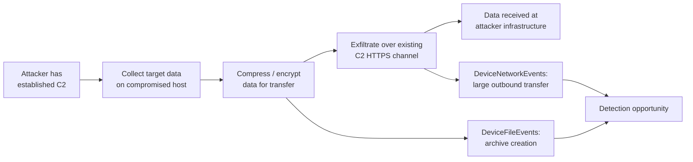
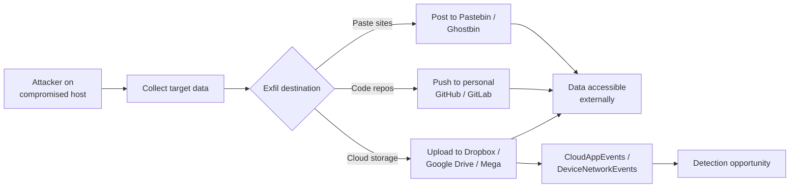
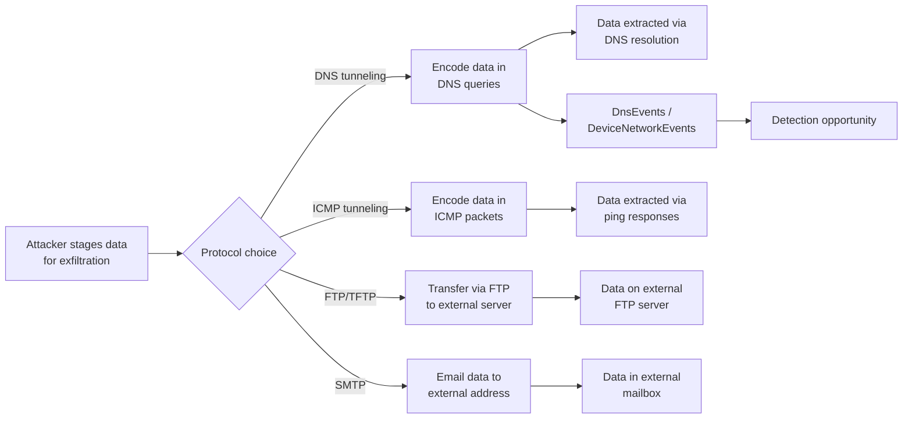
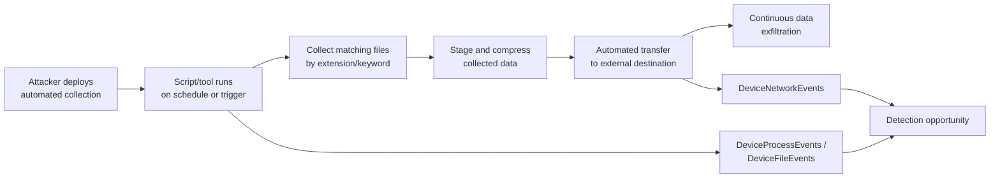

# Threat Model: Exfiltration (TA0010)

## Executive Summary

Exfiltration is the payoff — when attackers extract the data they came for. In Microsoft 365 environments, this means downloading SharePoint/OneDrive files, forwarding mailbox contents, uploading to cloud storage (Dropbox, Google Drive, Mega), or tunneling data over DNS/HTTPS to C2 infrastructure. Detection must correlate across endpoint file access, network traffic patterns, cloud app usage, and DLP policy violations. The challenge: legitimate data sharing looks very similar to exfiltration.

---

## Technique: T1041 — Exfiltration Over C2 Channel

### Attack Flow



### Data Sources

| MITRE Data Source | Microsoft Table | Connector Required | Notes |
|---|---|---|---|
| Network Traffic | `DeviceNetworkEvents` | Defender for Endpoint | Outbound data volume, connection patterns |
| File | `DeviceFileEvents` | Defender for Endpoint | File staging (compression, encryption) |
| Network Traffic | `CommonSecurityLog` | Firewall/proxy connector | Proxy logs with URL categories and byte counts |

### Detection Opportunities

**Opportunity 1: Large outbound transfer to uncommon destination**

```kql
// Anomalous outbound data volume to external IPs
DeviceNetworkEvents
| where ActionType == "ConnectionSuccess"
| where RemoteIPType == "Public"
| summarize
    TotalBytesSent = sum(SentBytes),
    ConnectionCount = count()
    by DeviceName, RemoteIP, bin(TimeGenerated, 1h)
| where TotalBytesSent > 100000000 // 100MB threshold
| where RemoteIP !in (known_cdn_ips) // Replace with known-good IPs
```

**Opportunity 2: Staging artifacts — archive creation before exfil**

```kql
// Archive file creation (zip, 7z, rar) followed by network transfer
DeviceFileEvents
| where ActionType == "FileCreated"
| where FileName endswith_cs ".zip" or FileName endswith_cs ".7z" or FileName endswith_cs ".rar"
| where FolderPath has_any ("\\Temp\\", "\\AppData\\", "\\Downloads\\")
| project ArchiveTime = TimeGenerated, DeviceName, FileName, FolderPath, InitiatingProcessName
```

**Opportunity 3: Data compression via command line tools**

```kql
// Command-line compression tools (staging for exfil)
DeviceProcessEvents
| where FileName in~ ("7z.exe", "rar.exe", "tar.exe", "compact.exe")
    or (FileName =~ "powershell.exe" and ProcessCommandLine has "Compress-Archive")
| project TimeGenerated, DeviceName, FileName, ProcessCommandLine, AccountName
```

### False Positive Scenarios

| Scenario | Cause | Tuning Approach |
|---|---|---|
| Cloud backup services | Backup agents uploading large datasets | Allowlist backup service destination IPs |
| Video conferencing | Teams/Zoom large data streams | Exclude known Microsoft/Zoom IP ranges |
| Software updates | Large downloads from CDNs | Filter by known CDN IP ranges |
| Developer uploads | Code pushes to GitHub/Azure DevOps | Allowlist development platform IPs |

### Microsoft Product Coverage

| Product | Coverage Type | Feature | Limitations |
|---|---|---|---|
| Defender for Endpoint | Detection | Suspicious outbound connection alerts | Requires MDE agent; encrypted traffic limits inspection |
| Purview DLP | Prevention & Detection | Endpoint DLP, cloud DLP | Only catches data matching DLP policies (sensitive info types) |
| Sentinel | Detection | Custom analytics on DeviceNetworkEvents | Requires volume threshold tuning per environment |

### Detection Gap Analysis

**Gaps:**
- **Encrypted C2 channels** — HTTPS-based C2 traffic looks identical to legitimate web browsing. SSL inspection or behavioral analysis required.
- **Low-and-slow exfiltration** — Small data transfers over long periods evade volume-based thresholds.
- **Steganography** — Data hidden in image or document files is undetectable by DLP or network monitoring.

**Compensating Controls:**
- Deploy SSL/TLS inspection on proxy/firewall for outbound HTTPS
- Implement network traffic anomaly detection (baseline + deviation)
- Use Purview DLP endpoint policies to block sensitive data in archive files
- Network segmentation — restrict which hosts can reach the internet directly

### Related Skills

- `skills/msft-security/purview-dlp-patterns.md` — DLP policy configuration for exfiltration
- `skills/msft-security/defender-for-endpoint.md` — Network protection and web content filtering

---

## Technique: T1567 — Exfiltration Over Web Service

### Sub-techniques covered
- T1567.002 — Exfiltration to Cloud Storage

### Attack Flow



### Data Sources

| MITRE Data Source | Microsoft Table | Connector Required | Notes |
|---|---|---|---|
| Application Log | `CloudAppEvents` | Defender for Cloud Apps | Upload activity to SaaS apps |
| Network Traffic | `DeviceNetworkEvents` | Defender for Endpoint | Connections to cloud storage domains |
| Web Proxy | `CommonSecurityLog` | Proxy/firewall connector | URL category: file sharing |
| File | `OfficeActivity` | Office 365 connector | SharePoint/OneDrive downloads |

### Detection Opportunities

**Opportunity 1: Upload to unsanctioned cloud storage**

```kql
// File uploads to known cloud storage services
CloudAppEvents
| where ActionType == "FileUploaded"
| where Application in ("Dropbox", "Google Drive", "Box", "Mega", "WeTransfer")
| summarize UploadCount = count(), TotalSize = sum(FileSize) by AccountDisplayName, Application, bin(TimeGenerated, 1h)
| where UploadCount > 5 or TotalSize > 50000000
```

**Opportunity 2: Bulk SharePoint/OneDrive download**

```kql
// Mass file download from SharePoint or OneDrive
OfficeActivity
| where Operation in ("FileDownloaded", "FileSyncDownloadedFull")
| summarize DownloadCount = count() by UserId, Site_Url, bin(TimeGenerated, 30m)
| where DownloadCount > 50
```

**Opportunity 3: Network connections to cloud storage domains**

```kql
// Endpoint connecting to cloud storage domains outside business apps
DeviceNetworkEvents
| where RemoteUrl has_any ("dropbox.com", "drive.google.com", "mega.nz",
    "wetransfer.com", "pastebin.com", "github.com")
| where InitiatingProcessName !in~ ("onedrive.exe", "teams.exe", "outlook.exe")
| summarize ConnectionCount = count(), BytesSent = sum(SentBytes)
    by DeviceName, RemoteUrl, InitiatingProcessName, bin(TimeGenerated, 1h)
```

### False Positive Scenarios

| Scenario | Cause | Tuning Approach |
|---|---|---|
| Approved cloud storage | Business units using Dropbox/Box with approval | Maintain approved app list; alert only on unsanctioned |
| Marketing file sharing | Marketing sharing large files externally | Correlate with marketing group membership |
| Code development | Developers pushing to approved GitHub repos | Allowlist corporate GitHub org URLs |

### Microsoft Product Coverage

| Product | Coverage Type | Feature | Limitations |
|---|---|---|---|
| Defender for Cloud Apps | Detection & Prevention | Cloud app discovery, session controls, upload blocking | Requires CASB license; inline blocking requires Conditional Access App Control |
| Purview DLP | Prevention | Cloud DLP for SharePoint/OneDrive/Exchange | Only blocks data matching DLP sensitive info types |
| Sentinel | Detection | Custom analytics on CloudAppEvents / OfficeActivity | Requires custom rules |
| Defender for Endpoint | Detection | Network protection, web content filtering | Can block categories but limited upload visibility |

### Detection Gap Analysis

**Gaps:**
- **Encrypted uploads via browser** — Web-based uploads to cloud storage via browser are hard to distinguish from normal web browsing without SSL inspection.
- **Personal accounts** — Users uploading to personal cloud storage accounts may use the same domains as corporate-approved services.
- **Novel exfil services** — New file sharing services emerge constantly; allowlist/blocklist approaches require continuous maintenance.

**Compensating Controls:**
- Deploy Defender for Cloud Apps with session controls to monitor and block uploads
- Use web content filtering to block "file sharing" URL category
- Implement Purview DLP endpoint policies to prevent sensitive data uploads
- Restrict browser access to only approved cloud storage services via proxy

### Related Skills

- `skills/msft-security/purview-dlp-patterns.md` — DLP policies for cloud exfiltration
- `skills/msft-security/defender-xdr-configuration.md` — Cloud app discovery and control

---

## Technique: T1048 — Exfiltration Over Alternative Protocol

### Sub-techniques covered
- T1048.003 — Exfiltration Over Unencrypted Non-C2 Protocol

### Attack Flow



### Data Sources

| MITRE Data Source | Microsoft Table | Connector Required | Notes |
|---|---|---|---|
| Network Traffic | `DnsEvents` | DNS connector | DNS query patterns, lengths, volumes |
| Network Traffic | `DeviceNetworkEvents` | Defender for Endpoint | Non-standard protocol connections |
| Network Traffic | `CommonSecurityLog` | Firewall connector | Protocol-level traffic analysis |
| Application Log | `OfficeActivity` | Office 365 connector | Email forwarding rules |

### Detection Opportunities

**Opportunity 1: DNS tunneling — anomalous query patterns**

```kql
// DNS tunneling indicators: long subdomain names, high query volume
DnsEvents
| where Name !endswith ".in-addr.arpa"
| extend SubdomainLength = strlen(tostring(split(Name, ".")[0]))
| where SubdomainLength > 30 // Encoded data in subdomain
| summarize QueryCount = count(), AvgLength = avg(SubdomainLength)
    by ClientIP, Name, bin(TimeGenerated, 10m)
| where QueryCount > 20
```

**Opportunity 2: Unusual protocol usage**

```kql
// Outbound connections on non-standard ports (FTP, TFTP, ICMP tunnels)
DeviceNetworkEvents
| where RemotePort in (20, 21, 69) // FTP, TFTP
| where RemoteIPType == "Public"
| project TimeGenerated, DeviceName, RemoteIP, RemotePort, InitiatingProcessName
```

**Opportunity 3: Auto-forwarding rules to external addresses**

```kql
// Mailbox forwarding rules sending to external domains
OfficeActivity
| where Operation in ("New-InboxRule", "Set-InboxRule", "Set-Mailbox")
| extend RuleParams = tostring(Parameters)
| where RuleParams has_any ("ForwardTo", "ForwardAsAttachmentTo", "RedirectTo")
| where RuleParams !has "@contoso.com" // External forwarding
| project TimeGenerated, UserId, Operation, RuleParams, ClientIP
```

### False Positive Scenarios

| Scenario | Cause | Tuning Approach |
|---|---|---|
| DNS-over-HTTPS resolvers | Legitimate DoH usage creates long DNS queries | Identify DoH resolver domains and exclude |
| Legitimate FTP transfers | File transfers to approved partners | Allowlist approved FTP endpoints |
| Mail forwarding for backups | Users forwarding to personal email for backup | Enforce anti-forwarding transport rules |
| CDN/SaaS DNS | Long CNAME chains for CDN services | Exclude known CDN domain patterns |

### Microsoft Product Coverage

| Product | Coverage Type | Feature | Limitations |
|---|---|---|---|
| Defender for Endpoint | Detection | DNS anomaly detection, network protection | Limited DNS tunneling detection out-of-box |
| Sentinel | Detection | Custom analytics on DnsEvents | Requires DNS logging enabled and custom rules |
| Exchange Online | Prevention | Transport rules blocking auto-forwarding | Only for email-based exfiltration |
| Purview DLP | Prevention | Email DLP policies | Only catches content matching SIT patterns |

### Detection Gap Analysis

**Gaps:**
- **DNS-over-HTTPS (DoH)** — DNS tunneling over DoH bypasses traditional DNS monitoring entirely since queries are encrypted in HTTPS.
- **ICMP tunneling** — Most Microsoft security products don't inspect ICMP payload content.
- **Slow DNS exfiltration** — Very slow DNS tunneling (few queries per minute) looks like normal DNS resolution.

**Compensating Controls:**
- Block DNS-over-HTTPS at the firewall; force all DNS through monitored resolvers
- Monitor ICMP traffic volume and payload sizes at the firewall
- Implement outbound FTP/TFTP blocking at the firewall
- Deploy Exchange Online transport rules blocking auto-forwarding to external domains

### Related Skills

- `skills/msft-security/purview-dlp-patterns.md` — Email DLP and transport rules
- `skills/detection/scheduled-rule-pattern.md` — DNS tunneling detection rules

---

## Technique: T1020 — Automated Exfiltration

### Attack Flow



### Data Sources

| MITRE Data Source | Microsoft Table | Connector Required | Notes |
|---|---|---|---|
| Process Creation | `DeviceProcessEvents` | Defender for Endpoint | Scripted collection patterns |
| File | `DeviceFileEvents` | Defender for Endpoint | Bulk file access patterns |
| Network Traffic | `DeviceNetworkEvents` | Defender for Endpoint | Periodic outbound transfers |
| Command Execution | `DeviceEvents` | Defender for Endpoint | Script execution events |

### Detection Opportunities

**Opportunity 1: Periodic large outbound transfers**

```kql
// Regular outbound data transfers to same destination
DeviceNetworkEvents
| where ActionType == "ConnectionSuccess"
| where RemoteIPType == "Public"
| where SentBytes > 10000000 // 10MB+
| summarize TransferCount = count(), TotalBytes = sum(SentBytes)
    by DeviceName, RemoteIP, bin(TimeGenerated, 1d)
| where TransferCount > 3 // Multiple transfers per day
```

**Opportunity 2: Scripted bulk file enumeration**

```kql
// PowerShell or script enumerating many files by extension
DeviceProcessEvents
| where FileName in~ ("powershell.exe", "cmd.exe", "python.exe")
| where ProcessCommandLine has_any ("Get-ChildItem", "dir /s", "*.docx", "*.xlsx", "*.pdf", "*.pst")
| project TimeGenerated, DeviceName, AccountName, ProcessCommandLine
```

### False Positive Scenarios

| Scenario | Cause | Tuning Approach |
|---|---|---|
| Scheduled backup jobs | Automated backups to cloud storage | Allowlist backup service accounts and destinations |
| Data pipeline jobs | ETL processes moving data on schedule | Allowlist pipeline service accounts |
| Compliance archival | eDiscovery or legal hold export | Correlate with compliance case IDs |

### Microsoft Product Coverage

| Product | Coverage Type | Feature | Limitations |
|---|---|---|---|
| Defender for Endpoint | Detection | Suspicious file enumeration, network anomalies | Requires behavioral detection; automated tools vary widely |
| Purview DLP | Prevention | Content-based blocking on endpoints | Only blocks known sensitive content patterns |
| Sentinel | Detection | Custom analytics combining file and network events | Requires multi-table correlation |

### Detection Gap Analysis

**Gaps:**
- **Legitimate automation masking** — Attackers can mimic legitimate backup scripts, making behavioral distinction impossible without payload inspection.
- **Cloud-native exfiltration** — Automated exfiltration via cloud APIs (e.g., Graph API mailbox export) doesn't generate endpoint telemetry.
- **Encrypted payloads** — Automated exfiltration of encrypted archives bypasses DLP content inspection.

**Compensating Controls:**
- Implement data classification and Purview sensitivity labels on all high-value data
- Deploy insider risk management policies in Microsoft Purview
- Monitor Graph API usage patterns for anomalous bulk data access
- Restrict outbound network access from sensitive workloads via network segmentation

### Related Skills

- `skills/msft-security/purview-dlp-patterns.md` — Insider risk and DLP policies
- `skills/detection/watchlist-driven-detection.md` — Monitor high-value data repositories

---

## Coverage Matrix

| Technique ID | Technique Name | Detection Rule | Data Source Available | Coverage Level | Notes |
|---|---|---|---|---|---|
| T1041 | Exfil Over C2 | MDE + Sentinel | ✅ DeviceNetworkEvents | Partial | Encrypted C2 over HTTPS looks like normal traffic |
| T1567.002 | Exfil to Cloud Storage | MCAS + Sentinel | ✅ CloudAppEvents | Partial | Personal vs. corporate accounts hard to distinguish |
| T1048.003 | Exfil Over Alt Protocol | Sentinel + MDE | ✅ DnsEvents, DeviceNetworkEvents | Partial | DNS-over-HTTPS bypasses DNS monitoring |
| T1020 | Automated Exfiltration | MDE + Sentinel | ✅ DeviceFileEvents, DeviceNetworkEvents | Partial | Mimics legitimate automation |

### Coverage Summary

- **Full coverage:** 0 techniques
- **Partial coverage:** 4 techniques (all exfiltration techniques require behavioral analysis that generates false positives)
- **No coverage:** 0 techniques
- **Highest priority gap:** T1567.002 (Exfil to Cloud Storage) — The convergence of personal and corporate cloud storage usage makes distinguishing legitimate sharing from exfiltration the hardest detection challenge in this tactic.

---

## References

- [MITRE ATT&CK — Exfiltration](https://attack.mitre.org/tactics/TA0010/)
- [Microsoft Purview DLP documentation](https://learn.microsoft.com/en-us/purview/dlp-learn-about-dlp)
- [Defender for Cloud Apps documentation](https://learn.microsoft.com/en-us/defender-cloud-apps/)

---

## Revision History

| Date | Version | Author | Changes |
|---|---|---|---|
| 2026-04-28 | 1.0 | Kima | Initial threat model — exfiltration tactic |
