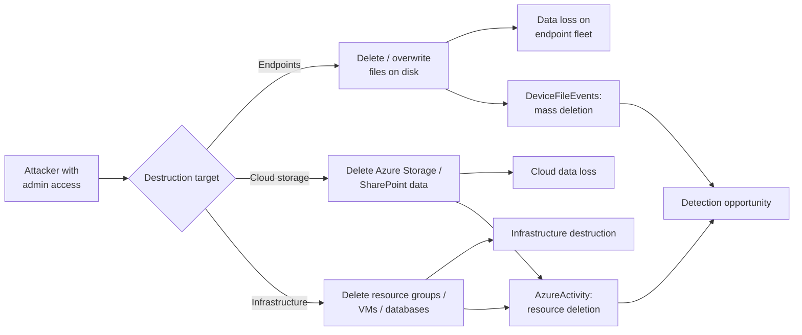
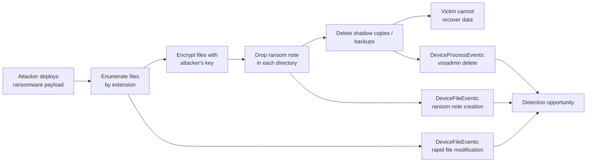
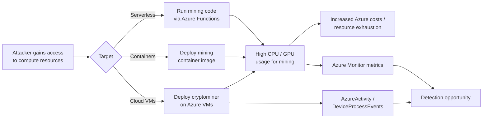
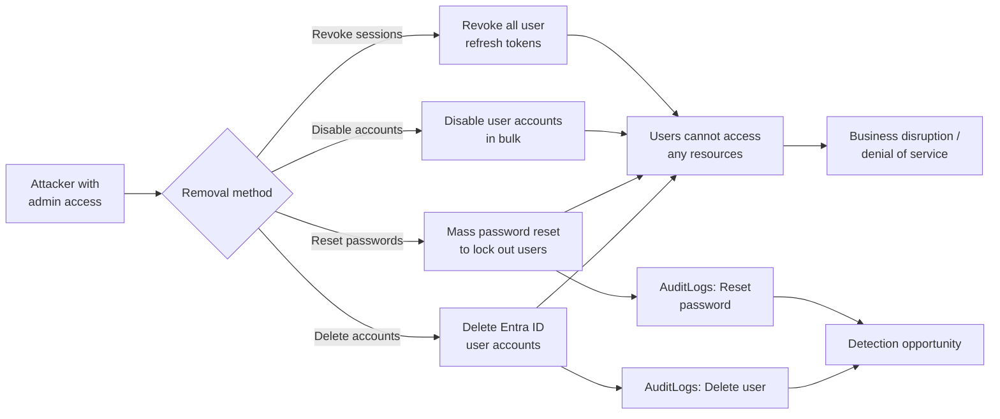

# Threat Model: Impact (TA0040)

## Executive Summary

Impact is the endgame — data destruction, ransomware encryption, cryptojacking, or locking legitimate users out. In Microsoft environments, this ranges from mass file encryption on endpoints (ransomware), to deleting Azure resource groups (wiper), to hijacking compute for cryptocurrency mining, to disabling or deleting user accounts to deny access. Detection at the Impact stage is often too late for prevention, but early detection can limit blast radius. The priority: detect the precursors (staging, privilege escalation) and have automated response playbooks ready for Impact indicators.

---

## Technique: T1485 — Data Destruction

### Attack Flow



### Data Sources

| MITRE Data Source | Microsoft Table | Connector Required | Notes |
|---|---|---|---|
| File | `DeviceFileEvents` | Defender for Endpoint | Mass file deletion/overwrite events |
| Cloud Service | `AzureActivity` | Azure Activity connector | Resource group/storage account deletion |
| Application Log | `OfficeActivity` | Office 365 connector | SharePoint file deletion |
| Process Creation | `DeviceProcessEvents` | Defender for Endpoint | Wiper tool execution |

### Detection Opportunities

**Opportunity 1: Mass file deletion on endpoints**

```kql
// Rapid bulk file deletion (wiper behavior)
DeviceFileEvents
| where ActionType == "FileDeleted"
| summarize
    DeleteCount = count(),
    Extensions = make_set(tostring(split(FileName, ".")[-1]), 20)
    by DeviceName, InitiatingProcessName, bin(TimeGenerated, 5m)
| where DeleteCount > 100
```

**Opportunity 2: Azure resource group deletion**

```kql
// Resource group or critical resource deletion
AzureActivity
| where OperationNameValue in (
    "Microsoft.Resources/subscriptions/resourceGroups/delete",
    "Microsoft.Storage/storageAccounts/delete",
    "Microsoft.Sql/servers/delete"
)
| where ActivityStatusValue == "Success"
| project TimeGenerated, Caller, ResourceGroup, OperationNameValue
```

**Opportunity 3: SharePoint/OneDrive mass deletion**

```kql
// Bulk file deletion from SharePoint/OneDrive
OfficeActivity
| where Operation == "FileDeleted"
| summarize DeleteCount = count() by UserId, Site_Url, bin(TimeGenerated, 30m)
| where DeleteCount > 50
```

### False Positive Scenarios

| Scenario | Cause | Tuning Approach |
|---|---|---|
| Data migration | Planned migration deleting old resources | Time-bound suppression with migration ticket reference |
| Cleanup scripts | IT cleanup of temp files or old data | Allowlist cleanup service accounts and paths |
| IaC teardown | Terraform destroy for dev environments | Restrict alerting to production subscriptions |

### Microsoft Product Coverage

| Product | Coverage Type | Feature | Limitations |
|---|---|---|---|
| Defender for Endpoint | Detection | Ransomware/wiper behavior detection | Only on managed endpoints |
| Defender for Cloud | Detection | Suspicious resource deletion alerts | Azure resources only |
| Sentinel | Detection | Custom analytics combining file + cloud events | Requires custom rules |
| SharePoint/OneDrive | Recovery | Recycle bin, versioning, restore | 93-day retention; doesn't prevent destruction |

### Detection Gap Analysis

**Gaps:**
- **Backup deletion before data destruction** — Sophisticated attackers delete backups first. Detection must cover backup deletion (Azure Backup vault, Recovery Services) as a precursor.
- **Cross-service destruction** — Coordinated deletion across Azure, M365, and on-prem requires cross-data-source correlation.
- **Insider threat** — Legitimate admins performing destruction may bypass behavioral detection if they have normal access patterns.

**Compensating Controls:**
- Enable soft-delete and retention policies on all Azure Storage and SQL databases
- Deploy Azure Resource Locks (CanNotDelete) on critical resources
- Require PIM activation for destructive operations (contributor/owner roles)
- Implement multi-person approval for resource group deletion via Azure Policy
- Enable SharePoint/OneDrive versioning and retention policies

### Related Skills

- `skills/msft-security/defender-for-cloud-policies.md` — Resource lock and deletion protection
- `skills/detection/nrt-rule-pattern.md` — Mass deletion should be NRT detection

---

## Technique: T1486 — Data Encrypted for Impact (Ransomware)

### Attack Flow



### Data Sources

| MITRE Data Source | Microsoft Table | Connector Required | Notes |
|---|---|---|---|
| File | `DeviceFileEvents` | Defender for Endpoint | Rapid file rename/modification with new extensions |
| Process Creation | `DeviceProcessEvents` | Defender for Endpoint | Shadow copy deletion, ransomware process execution |
| File | `DeviceFileEvents` | Defender for Endpoint | Ransom note file creation |

### Detection Opportunities

**Opportunity 1: Rapid file extension changes (encryption indicator)**

```kql
// Files renamed with suspicious new extensions (encryption pattern)
DeviceFileEvents
| where ActionType == "FileRenamed"
| where FileName endswith_cs ".encrypted" or FileName endswith_cs ".locked"
    or FileName endswith_cs ".crypto" or FileName matches regex @"\.[a-z]{5,8}$"
| summarize RenameCount = count() by DeviceName, InitiatingProcessName, bin(TimeGenerated, 2m)
| where RenameCount > 50
```

**Opportunity 2: Shadow copy deletion**

```kql
// Volume shadow copy deletion (pre-encryption ransomware step)
DeviceProcessEvents
| where FileName in~ ("vssadmin.exe", "wmic.exe", "wbadmin.exe", "bcdedit.exe")
| where ProcessCommandLine has_any ("delete shadows", "shadowcopy delete",
    "delete catalog", "recoveryenabled no")
| project TimeGenerated, DeviceName, AccountName, FileName, ProcessCommandLine
```

**Opportunity 3: Ransom note creation**

```kql
// Known ransom note file names
DeviceFileEvents
| where ActionType == "FileCreated"
| where FileName in~ ("README.txt", "DECRYPT.txt", "HOW_TO_DECRYPT.txt",
    "RECOVER_YOUR_FILES.txt", "!README!.txt")
| summarize NoteCount = count() by DeviceName, FileName, bin(TimeGenerated, 5m)
| where NoteCount > 3
```

**Opportunity 4: High file modification entropy**

```kql
// Process modifying many files rapidly (encryption behavior)
DeviceFileEvents
| where ActionType == "FileModified"
| summarize
    ModifiedCount = count(),
    UniqueExtensions = dcount(tostring(split(FileName, ".")[-1]))
    by DeviceName, InitiatingProcessName, bin(TimeGenerated, 1m)
| where ModifiedCount > 100 and UniqueExtensions < 3 // Many files, few extensions = encryption
```

### False Positive Scenarios

| Scenario | Cause | Tuning Approach |
|---|---|---|
| Legitimate encryption tools | BitLocker, VeraCrypt, 7-Zip operations | Allowlist known encryption tool processes |
| Backup software | Backup agents creating compressed/encrypted archives | Allowlist backup agent processes |
| File conversion scripts | Batch file conversion changing extensions | Correlate with known automation jobs |

### Microsoft Product Coverage

| Product | Coverage Type | Feature | Limitations |
|---|---|---|---|
| Defender for Endpoint | Prevention & Detection | Ransomware protection (controlled folder access), behavioral detection | Requires CFA enabled; may not catch novel ransomware variants |
| Sentinel | Detection | Fusion rule for ransomware, custom analytics | Fusion rule has limited coverage; custom rules needed |
| Defender for Cloud | Detection | Fileless attack detection, JIT access to reduce exposure | Server workloads only |

### Detection Gap Analysis

**Gaps:**
- **Pre-ransomware deployment** — By the time encryption starts, the attacker has already achieved their goal. Detection must focus on the kill chain *before* this point.
- **Human-operated ransomware (HumOR)** — Sophisticated ransomware operators spend days/weeks in the environment before deploying. Detection must catch the precursor activity.
- **Cloud ransomware** — Encryption of cloud-hosted files (SharePoint/OneDrive) via compromised sync client is an emerging vector.

**Compensating Controls:**
- Enable Controlled Folder Access on all endpoints (prevents unauthorized file modification)
- Deploy immutable backup strategy (air-gapped or immutable Azure Backup)
- Implement network segmentation to limit ransomware lateral spread
- Practice ransomware incident response playbooks regularly
- Enable OneDrive/SharePoint file versioning with long retention

### Related Skills

- `skills/msft-security/defender-for-endpoint.md` — Controlled Folder Access and ASR rules
- `skills/detection/nrt-rule-pattern.md` — Ransomware indicators must be NRT rules

---

## Technique: T1496 — Resource Hijacking

### Attack Flow



### Data Sources

| MITRE Data Source | Microsoft Table | Connector Required | Notes |
|---|---|---|---|
| Process Creation | `DeviceProcessEvents` | Defender for Endpoint | Mining process execution |
| Cloud Service | `AzureActivity` | Azure Activity connector | VM creation, scale-up events |
| Network Traffic | `DeviceNetworkEvents` | Defender for Endpoint | Connections to mining pools |
| Instance Metadata | `InsightsMetrics` | Azure Monitor | CPU utilization anomalies |

### Detection Opportunities

**Opportunity 1: Cryptocurrency mining process detection**

```kql
// Known mining process names or command-line indicators
DeviceProcessEvents
| where FileName in~ ("xmrig.exe", "cpuminer.exe", "minerd.exe", "ethminer.exe")
    or ProcessCommandLine has_any ("stratum+tcp", "stratum+ssl", "--coin=", "-o pool.", "cryptonight")
| project TimeGenerated, DeviceName, AccountName, FileName, ProcessCommandLine
```

**Opportunity 2: Network connections to mining pools**

```kql
// Outbound connections to known mining pool ports
DeviceNetworkEvents
| where RemotePort in (3333, 4444, 5555, 7777, 8888, 14444, 14433)
| where RemoteIPType == "Public"
| project TimeGenerated, DeviceName, RemoteIP, RemotePort, InitiatingProcessName
```

**Opportunity 3: Unexpected VM creation/scale-up**

```kql
// GPU or compute-optimized VM creation (mining infrastructure)
AzureActivity
| where OperationNameValue == "Microsoft.Compute/virtualMachines/write"
| where ActivityStatusValue == "Success"
| extend VMSize = tostring(parse_json(Properties).resource_size)
| where VMSize has_any ("NC", "ND", "NV", "Standard_F", "Standard_H") // GPU/compute families
| project TimeGenerated, Caller, ResourceGroup, VMSize
```

### False Positive Scenarios

| Scenario | Cause | Tuning Approach |
|---|---|---|
| Legitimate GPU workloads | ML training, rendering, HPC | Allowlist approved GPU workload resource groups |
| Stress testing | Performance testing with high CPU | Correlate with test schedules |
| CI/CD builds | Build agents with high CPU during compilation | Exclude CI/CD agent VMs |

### Microsoft Product Coverage

| Product | Coverage Type | Feature | Limitations |
|---|---|---|---|
| Defender for Cloud | Detection | Cryptomining alerts for VMs and containers | Requires Defender for Servers plan |
| Defender for Endpoint | Detection | Cryptomining process and network detection | Only on managed endpoints |
| Azure Cost Management | Detection | Budget alerts, cost anomalies | Reactive — costs already incurred |

### Detection Gap Analysis

**Gaps:**
- **Serverless mining** — Azure Functions or Logic Apps used for mining may not have process-level telemetry.
- **Low-intensity mining** — Miners configured for low CPU usage (20-30%) may not trigger performance anomalies.
- **Containerized mining** — Mining containers in AKS may evade host-level detection if runtime protection isn't enabled.

**Compensating Controls:**
- Enable Defender for Cloud on all subscriptions with Defender for Servers
- Implement Azure Budget alerts for unexpected compute cost spikes
- Use Azure Policy to restrict VM sizes (block GPU-optimized SKUs unless approved)
- Deploy container runtime security in AKS (Defender for Containers)

### Related Skills

- `skills/msft-security/defender-for-cloud-policies.md` — Defender for Servers and mining detection
- `skills/detection/scheduled-rule-pattern.md` — Mining pool connection detection

---

## Technique: T1531 — Account Access Removal

### Attack Flow



### Data Sources

| MITRE Data Source | Microsoft Table | Connector Required | Notes |
|---|---|---|---|
| User Account | `AuditLogs` | Entra ID connector | Account deletion, password reset, disable events |
| Logon Session | `SigninLogs` | Entra ID connector | Sign-in failures after account manipulation |

### Detection Opportunities

**Opportunity 1: Bulk account deletion**

```kql
// Mass user deletion from Entra ID
AuditLogs
| where OperationName == "Delete user"
| summarize DeleteCount = count(), Users = make_set(tostring(TargetResources[0].userPrincipalName), 20)
    by InitiatedBy = tostring(InitiatedBy.user.userPrincipalName), bin(TimeGenerated, 1h)
| where DeleteCount > 5
```

**Opportunity 2: Mass password reset**

```kql
// Bulk password resets by single admin
AuditLogs
| where OperationName in ("Reset password", "Reset user password")
| summarize ResetCount = count(), Users = make_set(tostring(TargetResources[0].userPrincipalName), 20)
    by ResetBy = tostring(InitiatedBy.user.userPrincipalName), bin(TimeGenerated, 1h)
| where ResetCount > 10
```

**Opportunity 3: Bulk account disable**

```kql
// Mass account disablement
AuditLogs
| where OperationName == "Disable account"
| summarize DisableCount = count() by InitiatedBy = tostring(InitiatedBy.user.userPrincipalName), bin(TimeGenerated, 1h)
| where DisableCount > 5
```

### False Positive Scenarios

| Scenario | Cause | Tuning Approach |
|---|---|---|
| Employee offboarding | HR-driven bulk account deprovisioning | Correlate with HR system termination events |
| Password rotation policy | Scheduled password resets | Exclude identity governance automation accounts |
| Org restructuring | Department mergers/splits with account changes | Time-bound suppression with restructuring ticket |

### Microsoft Product Coverage

| Product | Coverage Type | Feature | Limitations |
|---|---|---|---|
| Entra ID | Audit | Full audit trail for user lifecycle | Logging only — no native alerting on bulk operations |
| Sentinel | Detection | Custom analytics on AuditLogs | Requires custom threshold-based rules |
| Entra ID Governance | Prevention | Lifecycle workflows with approval | Only if provisioning goes through Governance workflows |

### Detection Gap Analysis

**Gaps:**
- **Admin account compromise** — If the attacker compromises a Global Admin account, bulk account manipulation looks like legitimate admin activity.
- **Soft-delete window** — Entra ID retains deleted users for 30 days. Automated recovery is possible but requires rapid detection.
- **Service principal manipulation** — Disabling service principals (not user accounts) can disrupt applications without user-visible symptoms initially.

**Compensating Controls:**
- Require PIM activation for Global Admin and User Admin roles
- Implement break-glass account protection (separate from normal admin accounts)
- Deploy automated monitoring for Entra ID deleted user count exceeding baseline
- Enable lifecycle workflows requiring multi-person approval for bulk operations
- Maintain service principal inventory and monitor for disable/delete events

### Related Skills

- `skills/msft-security/entra-id-protection.md` — Admin account risk monitoring
- `skills/detection/watchlist-driven-detection.md` — Critical account monitoring via watchlists

---

## Coverage Matrix

| Technique ID | Technique Name | Detection Rule | Data Source Available | Coverage Level | Notes |
|---|---|---|---|---|---|
| T1485 | Data Destruction | Sentinel + MDE | ✅ DeviceFileEvents, AzureActivity | Partial | Cross-service correlation needed for comprehensive coverage |
| T1486 | Ransomware | MDE + Sentinel | ✅ DeviceFileEvents, DeviceProcessEvents | Full | MDE behavioral detection + CFA prevention + shadow copy monitoring |
| T1496 | Resource Hijacking | Defender for Cloud + MDE | ✅ DeviceProcessEvents, AzureActivity | Partial | Serverless mining and low-intensity mining evade detection |
| T1531 | Account Access Removal | Sentinel custom rules | ✅ AuditLogs | Partial | Bulk operations detectable; admin account compromise is blind spot |

### Coverage Summary

- **Full coverage:** 1 technique (Ransomware — with MDE + Sentinel + controlled folder access)
- **Partial coverage:** 3 techniques (Data destruction, resource hijacking, account access removal)
- **No coverage:** 0 techniques
- **Highest priority gap:** T1485 (Data Destruction) — Coordinated destruction across Azure resources, M365, and endpoints requires cross-platform correlation that most environments lack. Resource locks and immutable backups are the primary compensating controls.

---

## References

- [MITRE ATT&CK — Impact](https://attack.mitre.org/tactics/TA0040/)
- [Microsoft ransomware incident response playbook](https://learn.microsoft.com/en-us/security/operations/incident-response-playbook-dart-ransomware-approach)
- [Azure resource locks documentation](https://learn.microsoft.com/en-us/azure/azure-resource-manager/management/lock-resources)

---

## Revision History

| Date | Version | Author | Changes |
|---|---|---|---|
| 2026-04-28 | 1.0 | Kima | Initial threat model — impact tactic |
