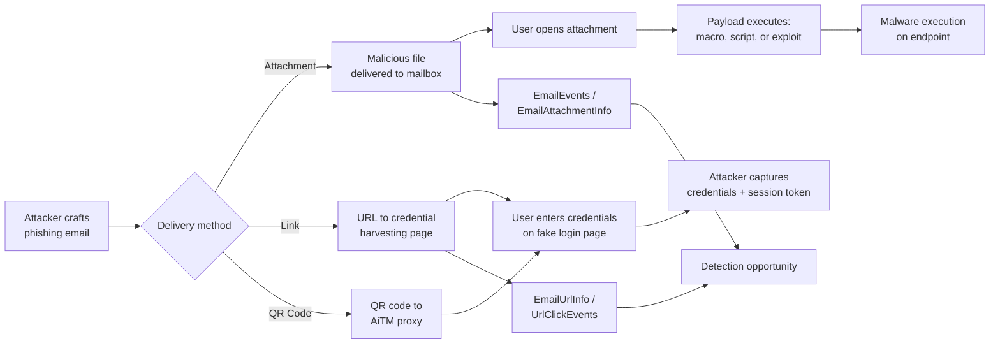
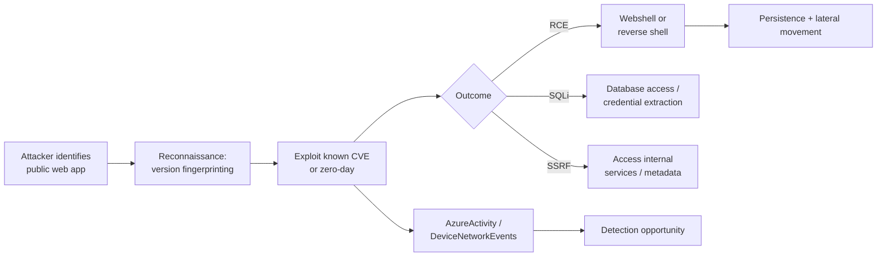
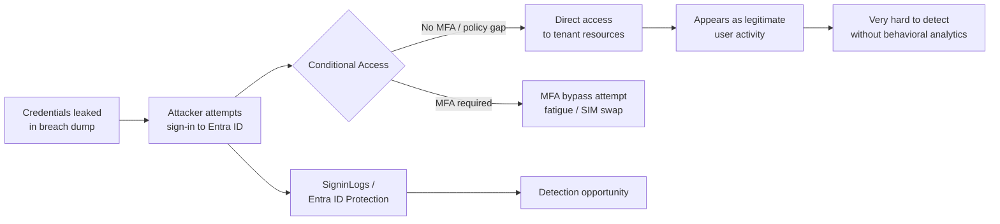
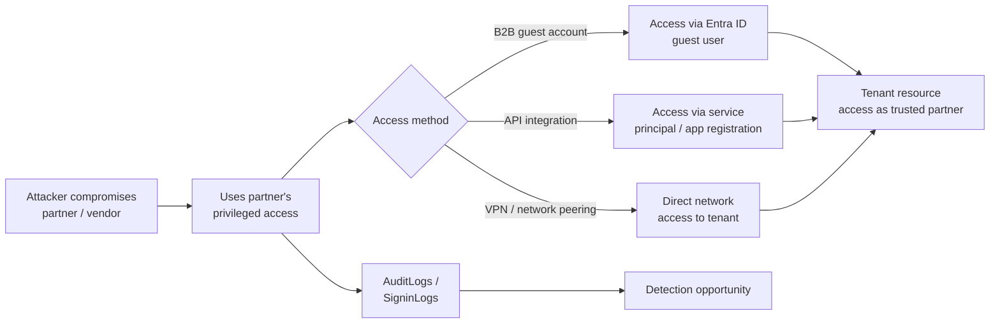

# Threat Model: Initial Access (TA0001)

## Executive Summary

Initial Access is the front door. Attackers need a way in — phishing an employee, exploiting a public-facing web app, using stolen credentials, or abusing a trusted third-party relationship. In Microsoft 365 environments, phishing dominates: credential phish via email, adversary-in-the-middle (AiTM) proxies, and QR code phish bypass traditional URL scanning. Our detection must cover email-borne threats, web application exploitation, credential reuse from external breaches, and supply chain / partner compromise vectors.

---

## Technique: T1566 — Phishing

### Sub-techniques covered
- T1566.001 — Spearphishing Attachment
- T1566.002 — Spearphishing Link

### Attack Flow



### Data Sources

| MITRE Data Source | Microsoft Table | Connector Required | Notes |
|---|---|---|---|
| Application Log | `EmailEvents` | Defender for Office 365 | Email metadata, delivery action, sender info |
| File | `EmailAttachmentInfo` | Defender for Office 365 | Attachment hashes, file names, types |
| Network Traffic | `EmailUrlInfo` | Defender for Office 365 | URLs in email bodies |
| Network Traffic | `UrlClickEvents` | Defender for Office 365 | User click-through tracking |
| Logon Session | `SigninLogs` | Entra ID connector | Post-phish credential usage |
| Process Creation | `DeviceProcessEvents` | Defender for Endpoint | Attachment payload execution |

### Detection Opportunities

**Opportunity 1: High-confidence phishing — ZAP'd email with user interaction**

```kql
// Emails delivered then ZAP'd (retroactive removal) where user interacted first
EmailEvents
| where DeliveryAction == "Delivered"
| where LatestDeliveryAction == "Junked" or LatestDeliveryAction == "Removed"
| join kind=inner (
    UrlClickEvents
    | where ActionType == "ClickAllowed"
) on NetworkMessageId
| project TimeGenerated, RecipientEmailAddress, SenderFromAddress, Subject, Url
```

**Opportunity 2: Credential phish — sign-in from phish-associated IP shortly after email delivery**

```kql
// User clicks URL in email, then signs in from new IP within 30 minutes
let PhishClicks = UrlClickEvents
| where TimeGenerated > ago(2h)
| where ActionType == "ClickAllowed"
| project ClickTime = TimeGenerated, UserId = AccountUpn, Url, UrlIP = IPAddress;
PhishClicks
| join kind=inner (
    SigninLogs
    | where ResultType == "0"
    | where TimeGenerated > ago(2h)
    | project SignInTime = TimeGenerated, UserPrincipalName, SignInIP = IPAddress
) on $left.UserId == $right.UserPrincipalName
| where SignInTime between (ClickTime .. (ClickTime + 30m))
| where SignInIP != "known_corporate_ip" // Replace with your egress IPs
```

**Opportunity 3: QR code phishing detection**

```kql
// Emails with image attachments and no URLs (potential QR code phish)
EmailAttachmentInfo
| where FileType in ("png", "jpg", "jpeg", "gif", "bmp")
| join kind=inner (
    EmailEvents
    | where DeliveryAction == "Delivered"
) on NetworkMessageId
| join kind=leftanti (
    EmailUrlInfo
) on NetworkMessageId
// Emails with image attachment but no embedded URLs — suspect QR code
| project TimeGenerated, RecipientEmailAddress, SenderFromAddress, Subject, FileName
```

### False Positive Scenarios

| Scenario | Cause | Tuning Approach |
|---|---|---|
| Marketing emails with tracking URLs | Click tracking pixels trigger URL click events | Allowlist known marketing platforms by sender domain |
| Internal phishing simulations | Security awareness training campaigns | Exclude simulation campaign sender addresses or use campaign tags |
| Legitimate file sharing via email | Attachments from known partners | Combine with sender reputation; known-good senders reduce severity |
| Password reset emails | Legitimate auth links clicked | Correlate with IT-initiated password reset events |

### Microsoft Product Coverage

| Product | Coverage Type | Feature | Limitations |
|---|---|---|---|
| Defender for Office 365 P2 | Prevention & Detection | Safe Attachments, Safe Links, ZAP, AIR | QR code phish in images may bypass URL scanning |
| Defender for Office 365 P1 | Prevention | Safe Attachments, Safe Links | No automated investigation; limited post-delivery |
| Entra ID Protection | Detection | Unfamiliar sign-in properties after phish | Reactive — detects compromise, not the phish itself |
| Defender for Endpoint | Detection | Attachment payload execution on endpoint | Only after user opens malicious attachment |

### Detection Gap Analysis

**Gaps:**
- **AiTM phishing proxies** — Evilginx-style proxies relay real Microsoft login pages; the URL isn't obviously malicious and MFA tokens are captured in real-time. Safe Links may not flag the domain.
- **QR code phishing** — URLs encoded in images bypass all URL scanning engines. Detection requires OCR on image attachments or behavioral correlation.
- **OAuth consent phishing** — Attacker sends link to consent to a malicious app; no credential entry, no detectable credential theft.
- **SMS/Teams phishing** — Attacks via non-email channels bypass Defender for Office 365 entirely.

**Compensating Controls:**
- Deploy phishing-resistant MFA (FIDO2 keys, Windows Hello) for all users — defeats AiTM
- Enable anti-phishing policies with mailbox intelligence and spoof protection
- Block auto-forwarding rules via transport rules (prevents post-compromise exfil)
- Train users on QR code phishing and OAuth consent attacks
- Restrict user consent to verified publisher apps only

### Related Skills

- `skills/detection/scheduled-rule-pattern.md` — Implement phishing detection rules
- `skills/detection/threat-model-template.md` — Contains a worked phishing credential theft example
- `skills/msft-security/defender-xdr-configuration.md` — Safe Attachments/Links configuration
- `skills/msft-security/entra-id-protection.md` — Post-phish risk detection

---

## Technique: T1190 — Exploit Public-Facing Application

### Attack Flow



### Data Sources

| MITRE Data Source | Microsoft Table | Connector Required | Notes |
|---|---|---|---|
| Application Log | `AzureActivity` | Azure Activity connector | Resource changes, management plane actions |
| Network Traffic | `DeviceNetworkEvents` | Defender for Endpoint | Outbound connections from web servers |
| Process Creation | `DeviceProcessEvents` | Defender for Endpoint | Webshell or child process execution |
| Cloud Service | `AzureDiagnostics` | Azure Diagnostics | WAF logs, App Service logs |

### Detection Opportunities

**Opportunity 1: Web server spawning unexpected processes**

```kql
// IIS/Apache spawning cmd, PowerShell, or bash (webshell indicator)
DeviceProcessEvents
| where InitiatingProcessName in ("w3wp.exe", "httpd.exe", "nginx.exe", "java.exe")
| where FileName in~ ("cmd.exe", "powershell.exe", "pwsh.exe", "bash", "sh")
| project TimeGenerated, DeviceName, InitiatingProcessName, FileName, ProcessCommandLine
```

**Opportunity 2: Exploitation artifacts in Azure WAF logs**

```kql
// Azure WAF blocking known exploit patterns
AzureDiagnostics
| where ResourceType == "APPLICATIONGATEWAYS"
| where action_s == "Blocked"
| where ruleGroup_s in ("REQUEST-932-APPLICATION-ATTACK-RCE", "REQUEST-942-APPLICATION-ATTACK-SQLI")
| summarize BlockCount = count() by clientIp_s, ruleId_s, bin(TimeGenerated, 5m)
| where BlockCount > 10
```

### False Positive Scenarios

| Scenario | Cause | Tuning Approach |
|---|---|---|
| Vulnerability scanners | Legitimate security scanning triggers WAF rules | Allowlist scanner IPs during scheduled scan windows |
| Developer debugging | Developers running commands on app servers | Correlate with change management or deployment pipeline |
| Health check scripts | Automated scripts spawning processes via web apps | Allowlist known health check process chains |

### Microsoft Product Coverage

| Product | Coverage Type | Feature | Limitations |
|---|---|---|---|
| Defender for Cloud | Detection | Vulnerability assessment, runtime threat protection | Requires Defender for Servers / App Service plan |
| Azure WAF | Prevention | OWASP rule sets, bot protection | Doesn't protect non-HTTP services; requires App Gateway or Front Door |
| Defender for Endpoint | Detection | Post-exploitation behavior detection | Only on managed servers with MDE agent |
| Sentinel | Detection | Custom rules on WAF + process logs | Requires correlation across data sources |

### Detection Gap Analysis

**Gaps:**
- **Zero-day exploits** — Signature-based WAF rules don't catch unknown vulnerabilities. Behavioral detection (unusual process spawning) is the primary compensating control.
- **Server-side request forgery (SSRF)** — SSRF attacks to Azure IMDS (169.254.169.254) may not generate process events. Must monitor for metadata endpoint access.
- **Container escapes** — If public apps run in containers, exploitation may target container runtime vulnerabilities outside endpoint telemetry.

**Compensating Controls:**
- Enable Defender for Cloud with runtime threat protection on all public-facing workloads
- Deploy Azure WAF with OWASP 3.2 rules on all internet-facing applications
- Implement network segmentation — public-facing apps shouldn't reach sensitive internal resources directly
- Patch management: automated vulnerability scanning and patch cycles

### Related Skills

- `skills/msft-security/defender-for-cloud-policies.md` — Defender plans for web apps and servers
- `skills/detection/nrt-rule-pattern.md` — Webshell detection should be NRT

---

## Technique: T1078 — Valid Accounts

### Attack Flow



### Data Sources

| MITRE Data Source | Microsoft Table | Connector Required | Notes |
|---|---|---|---|
| Logon Session | `SigninLogs` | Entra ID connector | Sign-in properties, location, device, risk |
| User Account | `AuditLogs` | Entra ID connector | Account changes post-compromise |
| Application Log | `CloudAppEvents` | Defender for Cloud Apps | Activity patterns |
| Active Directory | `IdentityLogonEvents` | Defender for Identity | On-prem AD authentication |

### Detection Opportunities

**Opportunity 1: Sign-in from atypical location or device**

```kql
// Sign-in risk: unfamiliar location + new device + non-corporate IP
SigninLogs
| where ResultType == "0"
| where RiskLevelDuringSignIn in ("medium", "high")
| where DeviceDetail.isManaged != true
| where NetworkLocationDetails !has "Corporate"
| project TimeGenerated, UserPrincipalName, IPAddress, Location, RiskLevelDuringSignIn, AppDisplayName
```

**Opportunity 2: Impossible travel**

```kql
// Two successful sign-ins from distant locations in short time
SigninLogs
| where ResultType == "0"
| project TimeGenerated, UserPrincipalName, IPAddress, Location
| sort by UserPrincipalName, TimeGenerated asc
| extend PrevTime = prev(TimeGenerated, 1), PrevLocation = prev(Location, 1), PrevUser = prev(UserPrincipalName, 1)
| where UserPrincipalName == PrevUser
| where datetime_diff('minute', TimeGenerated, PrevTime) < 60
| where Location != PrevLocation
```

### False Positive Scenarios

| Scenario | Cause | Tuning Approach |
|---|---|---|
| Employees traveling | Legitimate sign-ins from unusual locations | Use Entra ID named locations; travel-aware suppression |
| VPN split tunneling | Different egress IPs for different traffic | Include VPN provider IP ranges in known locations |
| Cloud app relays | SaaS apps authenticating from their infra IPs | Allowlist known SaaS provider IP ranges |

### Microsoft Product Coverage

| Product | Coverage Type | Feature | Limitations |
|---|---|---|---|
| Entra ID Protection | Detection | Leaked credentials detection, atypical travel, unfamiliar sign-in properties | Depends on credential leak feeds; sophisticated reuse from victim's geography evades |
| Defender for Cloud Apps | Detection | Activity policy, anomaly detection | Requires Cloud App Security license |
| Conditional Access | Prevention | Location/device/risk-based policies | Policies must exist; misconfigured policies = gaps |

### Detection Gap Analysis

**Gaps:**
- **Credential reuse from victim's geography** — If attacker uses residential proxy in the victim's city, location-based detection fails entirely.
- **Managed device spoofing** — If attacker registers a device and marks it compliant, device-based Conditional Access is bypassed.
- **No behavioral baseline for cloud-only accounts** — New accounts or infrequently used accounts lack historical baseline for anomaly detection.

**Compensating Controls:**
- Enforce Conditional Access requiring compliant/Hybrid Azure AD Joined devices
- Enable leaked credential detection in Entra ID Protection (requires P2)
- Deploy Continuous Access Evaluation (CAE) for near-real-time token revocation
- Monitor for bulk data access patterns post-authentication (the actual objective)

### Related Skills

- `skills/msft-security/entra-id-protection.md` — Risk-based Conditional Access policies
- `skills/detection/watchlist-driven-detection.md` — VIP account monitoring for credential reuse

---

## Technique: T1199 — Trusted Relationship

### Attack Flow



### Data Sources

| MITRE Data Source | Microsoft Table | Connector Required | Notes |
|---|---|---|---|
| Logon Session | `SigninLogs` | Entra ID connector | Guest user sign-ins (`UserType == "Guest"`) |
| User Account | `AuditLogs` | Entra ID connector | B2B invitation, guest access changes |
| Application Log | `AADServicePrincipalSignInLogs` | Entra ID connector | Multi-tenant app sign-ins |
| Network Traffic | `AzureNetworkAnalytics_CL` | NSG flow logs | Cross-tenant network traffic |

### Detection Opportunities

**Opportunity 1: Guest user accessing sensitive resources**

```kql
// Guest users accessing SharePoint, Teams, or Azure resources
SigninLogs
| where UserType == "Guest"
| where ResultType == "0"
| where AppDisplayName in ("Microsoft Teams", "SharePoint Online", "Azure Portal", "Microsoft Graph")
| summarize AccessCount = count(), Apps = make_set(AppDisplayName) by UserPrincipalName, IPAddress, bin(TimeGenerated, 1d)
```

**Opportunity 2: New multi-tenant app registration**

```kql
// Multi-tenant app consent from external tenant
AuditLogs
| where OperationName == "Consent to application"
| extend AppId = tostring(TargetResources[0].id)
| extend HomeTenantId = tostring(parse_json(AdditionalDetails[0]).value)
| where HomeTenantId != "<your-tenant-id>"
| project TimeGenerated, InitiatedBy, AppId, HomeTenantId
```

### False Positive Scenarios

| Scenario | Cause | Tuning Approach |
|---|---|---|
| Approved B2B partners | Regular partner collaboration | Maintain allowlist of approved partner tenant IDs |
| Vendor support sessions | Vendors accessing for support | Correlate with active support tickets |
| SaaS app integrations | Multi-tenant SaaS apps | Allowlist approved multi-tenant app registrations |

### Microsoft Product Coverage

| Product | Coverage Type | Feature | Limitations |
|---|---|---|---|
| Entra ID | Prevention | Cross-tenant access settings, guest access restrictions | Must be configured; default settings are permissive |
| Defender for Cloud Apps | Detection | Cross-tenant activity monitoring | Requires CASB license |
| Sentinel | Detection | Custom rules on guest sign-ins | Requires custom development |

### Detection Gap Analysis

**Gaps:**
- **Compromised partner's service principal** — If a partner's app registration is compromised, its access to your tenant looks normal. No behavioral anomaly from a permissions standpoint.
- **Supply chain attack via shared infrastructure** — VNet peering or shared ExpressRoute means network-level access bypasses identity-layer controls.
- **Delegated admin privileges (GDAP)** — CSP partners with delegated admin may have broad access that's hard to monitor.

**Compensating Controls:**
- Configure cross-tenant access settings with explicit allow/deny per partner tenant
- Restrict guest user access to specific resources (SharePoint, Teams) via access reviews
- Implement Privileged Identity Management (PIM) for guest accounts with elevated access
- Require partner MFA via cross-tenant trust settings

### Related Skills

- `skills/msft-security/entra-id-protection.md` — Guest user risk policies
- `skills/detection/mitre-attack-mapping.md` — Map supply chain coverage gaps

---

## Coverage Matrix

| Technique ID | Technique Name | Detection Rule | Data Source Available | Coverage Level | Notes |
|---|---|---|---|---|---|
| T1566.001 | Spearphishing Attachment | Defender for Office 365 + Sentinel | ✅ EmailEvents | Full | Safe Attachments provides inline detonation |
| T1566.002 | Spearphishing Link | Defender for Office 365 + Sentinel | ✅ EmailUrlInfo, UrlClickEvents | Partial | AiTM proxies and QR code phish bypass URL scanning |
| T1190 | Exploit Public-Facing App | Defender for Cloud + WAF + Sentinel | ✅ AzureDiagnostics, DeviceProcessEvents | Partial | Zero-day exploits require behavioral detection |
| T1078 | Valid Accounts | Entra ID Protection + Sentinel | ✅ SigninLogs | Partial | Residential proxy usage from victim's geo evades |
| T1199 | Trusted Relationship | Sentinel custom rules | ✅ SigninLogs, AuditLogs | Partial | Partner compromise looks like normal access |

### Coverage Summary

- **Full coverage:** 1 technique (Spearphishing Attachment)
- **Partial coverage:** 4 techniques (Spearphishing Link, Exploit Public-Facing App, Valid Accounts, Trusted Relationship)
- **No coverage:** 0 techniques
- **Highest priority gap:** T1566.002 (Spearphishing Link) — AiTM phishing proxy attacks bypass MFA and URL scanning; this is the #1 initial access vector in Microsoft 365 environments today.

---

## References

- [MITRE ATT&CK — Initial Access](https://attack.mitre.org/tactics/TA0001/)
- [Microsoft Defender for Office 365 documentation](https://learn.microsoft.com/en-us/defender-office-365/)
- [AiTM phishing attack analysis — Microsoft Threat Intelligence](https://www.microsoft.com/en-us/security/blog/2022/07/12/from-cookie-theft-to-bec-attackers-use-aitm-phishing-sites-as-entry-point-to-further-financial-fraud/)

---

## Revision History

| Date | Version | Author | Changes |
|---|---|---|---|
| 2026-04-28 | 1.0 | Kima | Initial threat model — initial access tactic |
