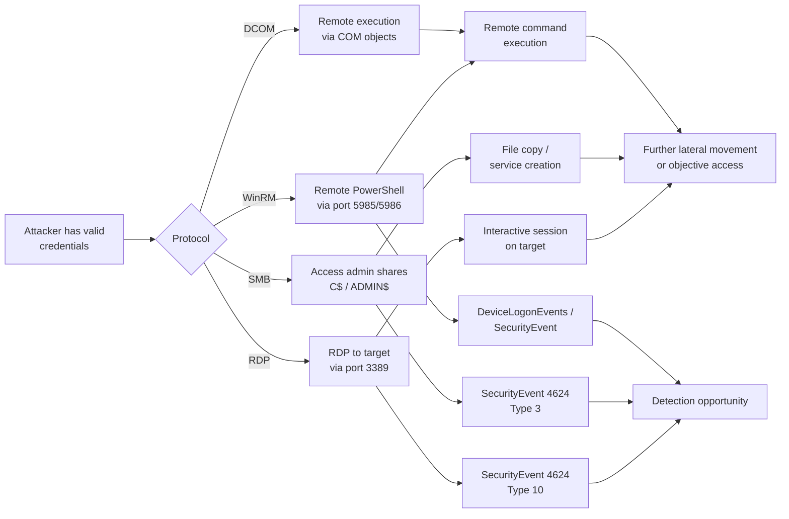
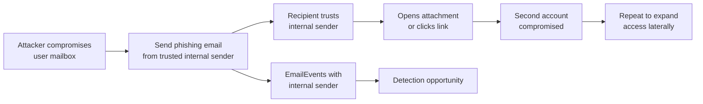
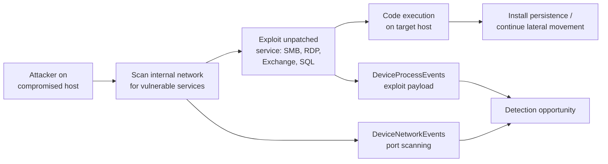
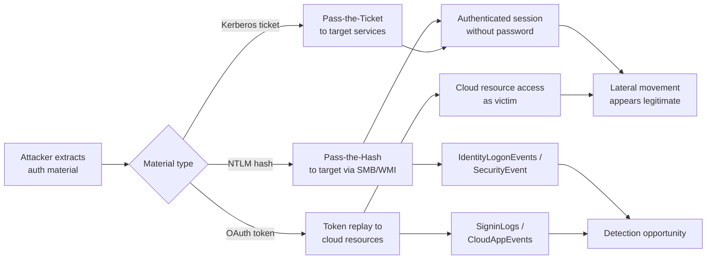

# Threat Model: Lateral Movement (TA0008)

## Executive Summary

Lateral movement is how attackers expand their reach once they have a foothold. In hybrid Microsoft environments, this means RDP/SMB between domain-joined endpoints, remote PowerShell to servers, SSH to Linux VMs, and increasingly — cloud-to-cloud movement using stolen tokens and shared credentials. The goal is always the same: reach high-value targets (DCs, data stores, admin workstations) from lower-value initial access points. Detection requires correlating authentication events across endpoints, network flows, and cloud identity logs.

---

## Technique: T1021 — Remote Services

### Sub-techniques covered
- T1021.001 — Remote Desktop Protocol (RDP)
- T1021.002 — SMB/Windows Admin Shares
- T1021.003 — Distributed Component Object Model (DCOM)
- T1021.006 — Windows Remote Management (WinRM)

### Attack Flow



### Data Sources

| MITRE Data Source | Microsoft Table | Connector Required | Notes |
|---|---|---|---|
| Logon Session | `SecurityEvent` | Windows Security Events connector | Event IDs 4624 (logon), 4625 (failed), 4648 (explicit creds) |
| Logon Session | `DeviceLogonEvents` | Defender for Endpoint | Endpoint logon events with device context |
| Network Traffic | `DeviceNetworkEvents` | Defender for Endpoint | Network connections to ports 3389, 445, 5985 |
| Active Directory | `IdentityLogonEvents` | Defender for Identity | Lateral movement path tracking |

### Detection Opportunities

**Opportunity 1: RDP to non-standard targets (workstation-to-workstation)**

```kql
// RDP sessions between workstations (not to servers/jump hosts)
DeviceLogonEvents
| where LogonType == "RemoteInteractive"
| where ActionType == "LogonSuccess"
| join kind=inner (
    DeviceInfo
    | where DeviceType == "Workstation"
    | distinct DeviceName
) on $left.DeviceName == $right.DeviceName
| where RemoteDeviceName !in ("jumphost01", "jumphost02") // Exclude approved jump hosts
| project TimeGenerated, DeviceName, RemoteDeviceName, AccountName, RemoteIP
```

**Opportunity 2: SMB admin share access from non-admin workstations**

```kql
// SMB connections to C$ or ADMIN$ shares
DeviceNetworkEvents
| where RemotePort == 445
| where ActionType == "ConnectionSuccess"
| join kind=inner (
    SecurityEvent
    | where EventID == 5140
    | where ShareName in ("\\\\*\\C$", "\\\\*\\ADMIN$")
    | project Computer, SubjectUserName, ShareAccess = ShareName
) on $left.DeviceName == $right.Computer
```

**Opportunity 3: WinRM lateral movement**

```kql
// WinRM connections — remote PowerShell execution
DeviceNetworkEvents
| where RemotePort in (5985, 5986)
| where ActionType == "ConnectionSuccess"
| project TimeGenerated, DeviceName, RemoteIP, RemotePort, InitiatingProcessName
| where InitiatingProcessName in~ ("powershell.exe", "pwsh.exe", "wsmprovhost.exe")
```

**Opportunity 4: Anomalous logon type 3 volume**

```kql
// Spike in network logons from single source (lateral movement campaign)
SecurityEvent
| where EventID == 4624
| where LogonType == 3
| summarize
    TargetCount = dcount(Computer),
    Targets = make_set(Computer, 20)
    by IpAddress, SubjectUserName, bin(TimeGenerated, 15m)
| where TargetCount > 5
```

### False Positive Scenarios

| Scenario | Cause | Tuning Approach |
|---|---|---|
| IT admin using RDP | Legitimate remote management | Allowlist admin accounts and approved jump hosts |
| SCCM/MECM deployments | Software deployment via admin shares | Allowlist SCCM server IPs and service accounts |
| Backup agent activity | Backup software accessing admin shares | Exclude backup service accounts |
| Monitoring tools | Agents checking remote services | Allowlist monitoring account SIDs |

### Microsoft Product Coverage

| Product | Coverage Type | Feature | Limitations |
|---|---|---|---|
| Defender for Identity | Detection | Lateral movement path detection, pass-the-hash/ticket alerts | Requires DC sensors on all DCs |
| Defender for Endpoint | Detection | Suspicious RDP, remote creation of services | Only on managed endpoints |
| Sentinel | Detection | Custom rules on SecurityEvent / DeviceLogonEvents | Requires tuning to reduce false positives |
| Entra ID | N/A | Cloud identity — no direct on-prem lateral movement coverage | Covers cloud-to-cloud movement via SigninLogs |

### Detection Gap Analysis

**Gaps:**
- **Unmanaged endpoints** — Devices without Defender for Endpoint agent have no lateral movement telemetry.
- **Encrypted RDP traffic** — Network monitoring can see RDP connections but not session content.
- **Legitimate admin tools** — PSExec, PsRemoting, SCCM all generate the same telemetry as attacker lateral movement. Detection must be behavioral, not signature-based.
- **Linux-to-Linux lateral movement** — SSH lateral movement between Linux VMs has different telemetry (syslog-based) and may not appear in Windows-centric detection rules.

**Compensating Controls:**
- Implement Local Administrator Password Solution (LAPS) to prevent credential reuse across endpoints
- Restrict RDP to approved jump hosts via Windows Firewall GPO
- Deploy Privileged Access Workstations (PAWs) for tier-0 administration
- Enable Defender for Identity lateral movement path analysis for visibility into possible paths

### Related Skills

- `skills/msft-security/defender-for-identity.md` — Lateral movement path detection
- `skills/msft-security/defender-for-endpoint.md` — Endpoint detection for remote service abuse
- `skills/detection/scheduled-rule-pattern.md` — Implement workstation-to-workstation RDP rule

---

## Technique: T1534 — Internal Spearphishing

### Attack Flow



### Data Sources

| MITRE Data Source | Microsoft Table | Connector Required | Notes |
|---|---|---|---|
| Application Log | `EmailEvents` | Defender for Office 365 | Internal email with suspicious indicators |
| User Account | `AuditLogs` | Entra ID connector | Inbox rule creation (forwarding, deletion) |
| Logon Session | `SigninLogs` | Entra ID connector | Post-compromise sign-in anomalies |

### Detection Opportunities

**Opportunity 1: Internal sender with inbox rule manipulation**

```kql
// Compromised mailbox creating forwarding/deletion rules (BEC pattern)
OfficeActivity
| where Operation in ("New-InboxRule", "Set-InboxRule")
| extend RuleParams = tostring(Parameters)
| where RuleParams has_any ("ForwardTo", "RedirectTo", "DeleteMessage")
| project TimeGenerated, UserId, Operation, RuleParams, ClientIP
```

**Opportunity 2: Internal phish — internal sender with suspicious attachment**

```kql
// Emails from internal senders with newly seen attachment hashes
EmailAttachmentInfo
| where SenderObjectId != "" // Internal sender
| where SHA256 !in (known_good_hashes) // Replace with watchlist or TI join
| join kind=inner EmailEvents on NetworkMessageId
| project TimeGenerated, SenderFromAddress, RecipientEmailAddress, Subject, FileName, SHA256
```

### False Positive Scenarios

| Scenario | Cause | Tuning Approach |
|---|---|---|
| Legitimate rule creation | Users setting up OOO or filtering rules | Only alert on ForwardTo external domains or DeleteMessage rules |
| File sharing via email | Users sharing documents internally | Combine with TI feed; only alert on unknown file hashes |

### Microsoft Product Coverage

| Product | Coverage Type | Feature | Limitations |
|---|---|---|---|
| Defender for Office 365 | Detection | Internal email scanning (limited), inbox rule alerts | Internal-to-internal scanning is less thorough than inbound |
| Sentinel | Detection | Custom rules on OfficeActivity + EmailEvents | Requires custom correlation |

### Detection Gap Analysis

**Gaps:**
- **Internal email reduced scanning** — Defender for Office 365 applies lighter inspection to internal mail vs. inbound, making malicious internal emails harder to catch.
- **Trust exploitation** — Users are far less suspicious of emails from known colleagues, reducing user-level reporting.
- **Teams-based internal phish** — Lateral phishing via Teams messages completely bypasses email-based detection.

**Compensating Controls:**
- Enable internal mail scanning in Defender for Office 365 (SafeInternalMailScanning)
- Monitor inbox rule creation as a high-fidelity BEC indicator
- User awareness training on internal phishing scenarios
- Deploy endpoint detection for payload execution regardless of delivery method

### Related Skills

- `skills/detection/nrt-rule-pattern.md` — Inbox rule creation should be NRT detection
- `skills/msft-security/defender-xdr-configuration.md` — Internal email scanning configuration

---

## Technique: T1210 — Exploitation of Remote Services

### Attack Flow



### Data Sources

| MITRE Data Source | Microsoft Table | Connector Required | Notes |
|---|---|---|---|
| Network Traffic | `DeviceNetworkEvents` | Defender for Endpoint | Internal network scanning patterns |
| Process Creation | `DeviceProcessEvents` | Defender for Endpoint | Exploit payload execution |
| Application Log | `SecurityEvent` | Windows Security Events | Service crash/restart events |

### Detection Opportunities

**Opportunity 1: Internal network scanning**

```kql
// Single host connecting to many internal IPs on same port (scanning)
DeviceNetworkEvents
| where ActionType == "ConnectionSuccess"
| where RemoteIPType == "Private"
| summarize
    TargetCount = dcount(RemoteIP),
    Targets = make_set(RemoteIP, 25)
    by DeviceName, RemotePort, bin(TimeGenerated, 10m)
| where TargetCount > 20
```

**Opportunity 2: Exploit-related process anomalies**

```kql
// Service processes spawning unexpected child processes (post-exploitation)
DeviceProcessEvents
| where InitiatingProcessName in ("sqlservr.exe", "w3wp.exe", "svchost.exe", "spoolsv.exe")
| where FileName in~ ("cmd.exe", "powershell.exe", "certutil.exe", "bitsadmin.exe")
| project TimeGenerated, DeviceName, InitiatingProcessName, FileName, ProcessCommandLine
```

### False Positive Scenarios

| Scenario | Cause | Tuning Approach |
|---|---|---|
| Vulnerability scanners | Nessus, Qualys running scheduled scans | Allowlist scanner IPs during scan windows |
| IT asset discovery | SCCM, Intune discovery cycles | Exclude management server IPs |
| Service restarts | Patching cycles cause process restarts | Correlate with patch deployment windows |

### Microsoft Product Coverage

| Product | Coverage Type | Feature | Limitations |
|---|---|---|---|
| Defender for Endpoint | Detection | Exploit protection, network protection | Only on managed endpoints |
| Defender for Cloud | Detection | Vulnerability assessment, just-in-time VM access | Covers Azure VMs; on-prem requires Arc |

### Detection Gap Analysis

**Gaps:**
- **Zero-day exploitation** — No signature for unknown vulnerabilities; behavioral detection is the only option.
- **Encrypted protocols** — Exploitation over encrypted channels (HTTPS, TLS-wrapped SMB) hides the exploit payload.
- **Unmanaged network segments** — Network segments without MDE agents have no visibility.

**Compensating Controls:**
- Aggressive patch management — reduce the exploitable surface
- Network segmentation with NSGs/firewalls between tiers
- Just-in-Time VM access for Azure VMs (reduces attack surface window)
- Enable exploit protection features in Defender for Endpoint

### Related Skills

- `skills/msft-security/defender-for-endpoint.md` — Exploit protection and network protection configuration
- `skills/msft-security/defender-for-cloud-policies.md` — Vulnerability assessment and JIT access

---

## Technique: T1550 — Use Alternate Authentication Material

### Sub-techniques covered
- T1550.001 — Application Access Token
- T1550.002 — Pass the Hash

### Attack Flow



### Data Sources

| MITRE Data Source | Microsoft Table | Connector Required | Notes |
|---|---|---|---|
| Active Directory | `IdentityLogonEvents` | Defender for Identity | Pass-the-Hash/Ticket detection |
| Logon Session | `SecurityEvent` | Windows Security Events | NTLM vs Kerberos logon type analysis |
| Logon Session | `SigninLogs` | Entra ID connector | Token replay detection |
| Application Log | `CloudAppEvents` | Defender for Cloud Apps | Cloud token usage patterns |

### Detection Opportunities

**Opportunity 1: Pass-the-Hash via Defender for Identity**

```kql
// Defender for Identity alerts for pass-the-hash
IdentityLogonEvents
| where ActionType == "LogonSuccess"
| where Protocol == "Ntlm"
| where isnotempty(AccountName)
| summarize NtlmCount = count() by AccountName, DeviceName, bin(TimeGenerated, 1h)
| where NtlmCount > 10 // Unusual NTLM volume
```

**Opportunity 2: Token replay — anomalous access pattern**

```kql
// OAuth token used from IP different from issuance IP
SigninLogs
| where ResultType == "0"
| where IsInteractive == false
| project TimeGenerated, UserPrincipalName, IPAddress, AppDisplayName, ResourceDisplayName
| sort by UserPrincipalName, TimeGenerated asc
| extend PrevIP = prev(IPAddress, 1), PrevUser = prev(UserPrincipalName, 1)
| where UserPrincipalName == PrevUser and IPAddress != PrevIP
```

### False Positive Scenarios

| Scenario | Cause | Tuning Approach |
|---|---|---|
| NTLM fallback | Legacy apps forcing NTLM instead of Kerberos | Identify and remediate NTLM-dependent apps; track expected NTLM sources |
| Multi-device users | Users legitimately switching between devices | Baseline normal device count per user |
| Service accounts | Service accounts using NTLM for legacy integrations | Allowlist known service account/device pairs |

### Microsoft Product Coverage

| Product | Coverage Type | Feature | Limitations |
|---|---|---|---|
| Defender for Identity | Detection | Pass-the-Hash, Pass-the-Ticket, Overpass-the-Hash alerts | Requires DC sensors; limited to AD-joined |
| Entra ID Protection | Detection | Token anomaly detection | Only for cloud tokens; limited to Entra ID-issued tokens |
| Sentinel | Detection | Custom analytics correlating NTLM patterns | Requires significant tuning |

### Detection Gap Analysis

**Gaps:**
- **Silver ticket attacks** — Forged TGS tickets bypass the DC entirely; Defender for Identity may not see them.
- **Golden ticket attacks** — Forged TGT tickets look like legitimate Kerberos auth; detection requires monitoring for TGT lifetime anomalies.
- **Cloud token theft from endpoints** — Stolen PRT/access tokens replayed from the same device look identical to normal activity.

**Compensating Controls:**
- Restrict NTLM authentication via GPO where possible
- Implement Credential Guard to protect NTLM hashes
- Enable Continuous Access Evaluation for cloud tokens
- Rotate KRBTGT password regularly (bi-annually minimum)

### Related Skills

- `skills/msft-security/defender-for-identity.md` — Pass-the-Hash/Ticket detection configuration
- `skills/msft-security/entra-id-protection.md` — Token anomaly detection

---

## Coverage Matrix

| Technique ID | Technique Name | Detection Rule | Data Source Available | Coverage Level | Notes |
|---|---|---|---|---|---|
| T1021.001 | RDP | Sentinel + MDE | ✅ DeviceLogonEvents | Partial | Requires workstation-to-workstation rule + jump host allowlist |
| T1021.002 | SMB/Admin Shares | Sentinel + MDE | ✅ DeviceNetworkEvents | Partial | High FP from SCCM/backup agents |
| T1021.003 | DCOM | Sentinel | ✅ DeviceProcessEvents | Partial | DCOM-specific telemetry is limited |
| T1021.006 | WinRM | Sentinel + MDE | ✅ DeviceNetworkEvents | Partial | Legitimate PowerShell remoting creates noise |
| T1534 | Internal Spearphishing | Defender for Office 365 + Sentinel | ✅ EmailEvents | Partial | Internal mail scanning is less thorough |
| T1210 | Exploitation of Remote Services | MDE + Defender for Cloud | ✅ DeviceNetworkEvents | Partial | Zero-day exploits evade signature detection |
| T1550.001 | Application Access Token | Entra ID Protection + Sentinel | ✅ SigninLogs | Partial | PRT theft is very hard to detect |
| T1550.002 | Pass the Hash | Defender for Identity + Sentinel | ✅ IdentityLogonEvents | Full | Requires DC sensors on all DCs |

### Coverage Summary

- **Full coverage:** 1 technique (Pass the Hash — with Defender for Identity sensors)
- **Partial coverage:** 7 techniques
- **No coverage:** 0 techniques
- **Highest priority gap:** T1021.001/002 (RDP/SMB) — The sheer volume of legitimate admin activity makes behavioral detection essential but challenging. LAPS and PAW deployment are critical compensating controls.

---

## References

- [MITRE ATT&CK — Lateral Movement](https://attack.mitre.org/tactics/TA0008/)
- [Defender for Identity lateral movement paths](https://learn.microsoft.com/en-us/defender-for-identity/understand-lateral-movement-paths)
- [Microsoft LAPS documentation](https://learn.microsoft.com/en-us/windows-server/identity/laps/laps-overview)

---

## Revision History

| Date | Version | Author | Changes |
|---|---|---|---|
| 2026-04-28 | 1.0 | Kima | Initial threat model — lateral movement tactic |
