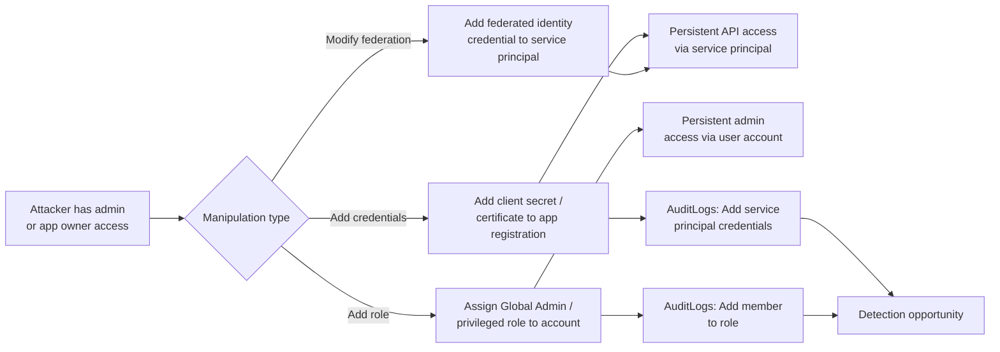
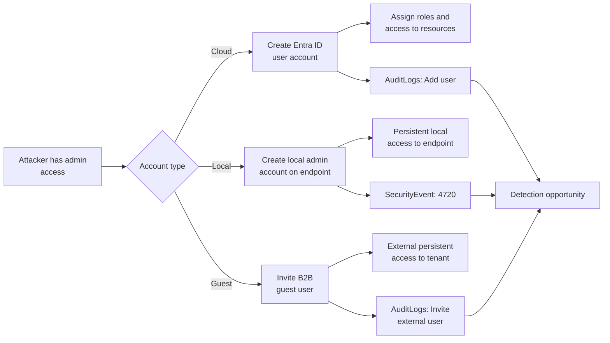
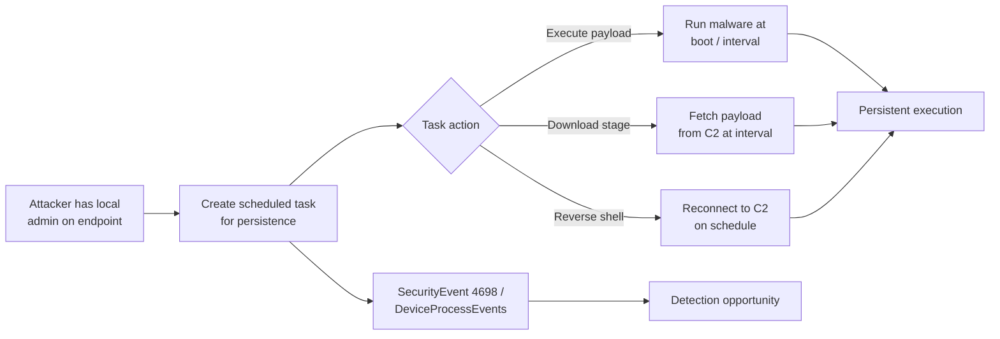
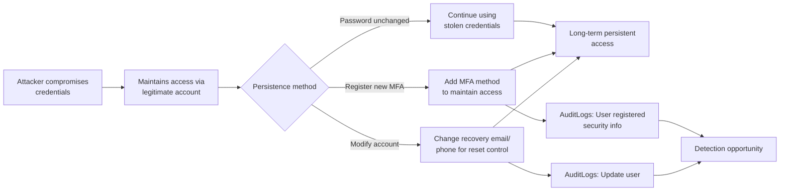
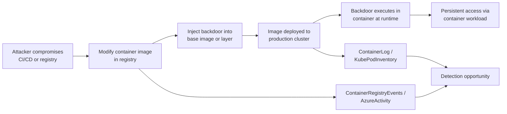

# Threat Model: Persistence (TA0003)

## Executive Summary

Persistence is how attackers keep their access after reboot, password reset, or incident response. In Microsoft environments, persistence ranges from creating shadow admin accounts in Entra ID, to manipulating service principal credentials, to scheduled tasks on endpoints, to implanting backdoored container images. The challenge: many persistence mechanisms look identical to legitimate administration. Detection requires baselining normal admin activity and alerting on deviations.

---

## Technique: T1098 — Account Manipulation

### Sub-techniques covered
- T1098.001 — Additional Cloud Credentials
- T1098.003 — Additional Cloud Roles

### Attack Flow



### Data Sources

| MITRE Data Source | Microsoft Table | Connector Required | Notes |
|---|---|---|---|
| User Account | `AuditLogs` | Entra ID connector | Role assignments, credential changes |
| Cloud Service | `AzureActivity` | Azure Activity connector | Azure RBAC changes |
| Application Log | `AADServicePrincipalSignInLogs` | Entra ID connector | Service principal authentication |

### Detection Opportunities

**Opportunity 1: New credentials added to app registration**

```kql
// Service principal credential addition (new secret or certificate)
AuditLogs
| where OperationName in ("Add service principal credentials", "Update application – Certificates and secrets management")
| extend AppName = tostring(TargetResources[0].displayName)
| extend ModifiedBy = tostring(InitiatedBy.user.userPrincipalName)
| project TimeGenerated, ModifiedBy, AppName, OperationName
```

**Opportunity 2: Privileged role assignment**

```kql
// Admin role assigned — especially Global Admin, Privileged Role Admin
AuditLogs
| where OperationName == "Add member to role"
| extend RoleName = tostring(TargetResources[0].displayName)
| extend TargetUser = tostring(TargetResources[0].userPrincipalName)
| extend AssignedBy = tostring(InitiatedBy.user.userPrincipalName)
| where RoleName in ("Global Administrator", "Privileged Role Administrator",
    "Exchange Administrator", "SharePoint Administrator", "Application Administrator")
| project TimeGenerated, AssignedBy, TargetUser, RoleName
```

**Opportunity 3: Federated credential added to service principal**

```kql
// Federated identity credential added (workload identity federation)
AuditLogs
| where OperationName has "federatedIdentityCredential"
| extend AppName = tostring(TargetResources[0].displayName)
| extend ModifiedBy = tostring(InitiatedBy.user.userPrincipalName)
| project TimeGenerated, ModifiedBy, AppName, OperationName
```

### False Positive Scenarios

| Scenario | Cause | Tuning Approach |
|---|---|---|
| DevOps credential rotation | Automated pipelines rotating app secrets | Allowlist pipeline service accounts; correlate with CI/CD systems |
| Admin onboarding | Granting new admins required roles | Correlate with HR/Identity Governance processes |
| Break-glass account setup | Emergency admin account configuration | Track break-glass accounts separately via watchlist |
| App development | Developers adding credentials during development | Separate dev tenant alerts from production |

### Microsoft Product Coverage

| Product | Coverage Type | Feature | Limitations |
|---|---|---|---|
| Entra ID PIM | Prevention | Just-in-time role activation, approval workflows | Only for roles managed via PIM; permanent assignments bypass |
| Sentinel | Detection | Custom analytics on AuditLogs | Requires custom rules; no built-in credential monitoring |
| Defender for Cloud Apps | Detection | App governance alerts | Requires app governance add-on |

### Detection Gap Analysis

**Gaps:**
- **Permanent vs. eligible role assignments** — PIM only protects roles assigned through PIM. Direct permanent assignments bypass all PIM controls.
- **App owner self-assignment** — If an attacker is an owner of an app registration, they can add credentials without triggering admin-level alerts.
- **Multi-tenant app abuse** — Adding credentials to a multi-tenant app owned in another tenant won't appear in your AuditLogs.

**Compensating Controls:**
- Enforce PIM for all privileged roles (no permanent assignments except break-glass)
- Restrict app registration creation and ownership to approved identities
- Monitor service principal sign-ins with new credentials (join AuditLogs + AADServicePrincipalSignInLogs)
- Implement access reviews for all admin role assignments quarterly

### Related Skills

- `skills/msft-security/entra-id-protection.md` — Risk policies for admin accounts
- `skills/detection/watchlist-driven-detection.md` — Break-glass account monitoring

---

## Technique: T1136 — Create Account

### Sub-techniques covered
- T1136.001 — Local Account
- T1136.003 — Cloud Account

### Attack Flow



### Data Sources

| MITRE Data Source | Microsoft Table | Connector Required | Notes |
|---|---|---|---|
| User Account | `AuditLogs` | Entra ID connector | User creation, guest invitation |
| User Account | `SecurityEvent` | Windows Security Events | Event ID 4720 (local account creation) |
| Active Directory | `IdentityDirectoryEvents` | Defender for Identity | AD user creation |

### Detection Opportunities

**Opportunity 1: Cloud account creation outside normal process**

```kql
// Entra ID user creation — flag if not from expected source
AuditLogs
| where OperationName == "Add user"
| extend CreatedBy = tostring(InitiatedBy.user.userPrincipalName)
| extend NewUser = tostring(TargetResources[0].userPrincipalName)
| where CreatedBy !in ("hr-provisioning@contoso.com", "identity-lifecycle@contoso.com") // Expected sources
| project TimeGenerated, CreatedBy, NewUser
```

**Opportunity 2: Local account creation on servers**

```kql
// Local admin account creation on non-workstation devices
SecurityEvent
| where EventID == 4720
| where Computer !startswith "WS-" // Exclude workstations (adjust naming convention)
| project TimeGenerated, Computer, SubjectUserName, TargetUserName
```

**Opportunity 3: Guest user invitation from non-approved source**

```kql
// B2B guest user invited by non-admin
AuditLogs
| where OperationName == "Invite external user"
| extend InvitedBy = tostring(InitiatedBy.user.userPrincipalName)
| extend GuestEmail = tostring(TargetResources[0].displayName)
| where InvitedBy !in ("admin-team-dl@contoso.com") // Expected inviters
```

### False Positive Scenarios

| Scenario | Cause | Tuning Approach |
|---|---|---|
| HR onboarding | New employee accounts via Identity Governance | Allowlist provisioning service principals |
| Partner collaboration | Legitimate B2B guest invitations | Require approval workflow; alert only on non-approved |
| Service account creation | IT creating service accounts for new apps | Correlate with change management tickets |

### Microsoft Product Coverage

| Product | Coverage Type | Feature | Limitations |
|---|---|---|---|
| Entra ID Governance | Prevention | Entitlement management, access packages | Only for managed invitation workflows |
| Sentinel | Detection | Custom analytics on AuditLogs / SecurityEvent | Requires custom rules |
| Defender for Identity | Detection | Suspicious account creation in AD | On-prem AD only |

### Detection Gap Analysis

**Gaps:**
- **Identity Governance bypass** — If an attacker has sufficient permissions, they can create accounts directly via Graph API, bypassing Identity Governance workflows.
- **Dormant accounts** — Created accounts that aren't used immediately may not trigger behavioral alerts until much later.
- **Federated identity providers** — Accounts created in a federated IdP sync to Entra ID and may bypass Entra ID creation monitoring.

**Compensating Controls:**
- Require approval workflows for all user creation (Identity Governance access packages)
- Restrict B2B guest invitation permissions to specific admin roles
- Monitor for accounts created and then immediately assigned privileged roles
- Regular access reviews to identify unknown or dormant accounts

### Related Skills

- `skills/detection/scheduled-rule-pattern.md` — Implement account creation monitoring rules
- `skills/msft-security/defender-for-identity.md` — AD account creation alerts

---

## Technique: T1053 — Scheduled Task/Job

### Sub-techniques covered
- T1053.005 — Scheduled Task (Windows)

### Attack Flow



### Data Sources

| MITRE Data Source | Microsoft Table | Connector Required | Notes |
|---|---|---|---|
| Scheduled Job | `SecurityEvent` | Windows Security Events | Event ID 4698 (task created), 4702 (task updated) |
| Process Creation | `DeviceProcessEvents` | Defender for Endpoint | schtasks.exe execution |
| Command Execution | `DeviceEvents` | Defender for Endpoint | Scheduled task registration events |

### Detection Opportunities

**Opportunity 1: Scheduled task creation with suspicious action**

```kql
// Scheduled task created with executable from temp/user profile paths
DeviceProcessEvents
| where FileName =~ "schtasks.exe"
| where ProcessCommandLine has "/create"
| where ProcessCommandLine has_any ("\\Temp\\", "\\AppData\\", "\\Downloads\\", "powershell -e", "cmd /c")
| project TimeGenerated, DeviceName, AccountName, ProcessCommandLine
```

**Opportunity 2: Task created via non-standard process**

```kql
// Scheduled task creation from unexpected parent process
SecurityEvent
| where EventID == 4698
| extend TaskContent = tostring(EventData)
| where TaskContent has_any ("powershell", "cmd.exe", "mshta.exe", "wscript.exe", "certutil")
| project TimeGenerated, Computer, SubjectUserName, TaskContent
```

### False Positive Scenarios

| Scenario | Cause | Tuning Approach |
|---|---|---|
| Windows Update | System-created tasks for update orchestration | Filter by SYSTEM account and known Windows task paths |
| Software installation | Installers creating scheduled tasks | Correlate with approved software deployment |
| Monitoring agents | IT agents with scheduled maintenance tasks | Allowlist known agent task names |

### Microsoft Product Coverage

| Product | Coverage Type | Feature | Limitations |
|---|---|---|---|
| Defender for Endpoint | Detection | Suspicious scheduled task alerts, ASR rules | Only on managed endpoints |
| Sentinel | Detection | Custom analytics on SecurityEvent 4698 | Requires task audit policy enabled |

### Detection Gap Analysis

**Gaps:**
- **Task modification vs. creation** — Modifying an existing legitimate task to execute malicious code is harder to detect than creating new tasks.
- **COM handler tasks** — Tasks that use COM handler actions instead of executable paths are harder to analyze.
- **Linux cron jobs** — Linux persistence via cron requires separate syslog-based detection.

**Compensating Controls:**
- Enable "Audit Other Object Access Events" for scheduled task auditing
- Restrict scheduled task creation to admin accounts via GPO
- Deploy ASR rule: "Block process creations originating from PSExec and WMI commands"
- Monitor for tasks that execute from unusual directories

### Related Skills

- `skills/msft-security/defender-for-endpoint.md` — ASR rules for task creation
- `skills/detection/nrt-rule-pattern.md` — Suspicious task creation as NRT rule

---

## Technique: T1078 — Valid Accounts (Persistence Context)

### Attack Flow



### Data Sources

| MITRE Data Source | Microsoft Table | Connector Required | Notes |
|---|---|---|---|
| User Account | `AuditLogs` | Entra ID connector | MFA registration, profile changes |
| Logon Session | `SigninLogs` | Entra ID connector | Ongoing access patterns |

### Detection Opportunities

**Opportunity 1: MFA method registration from suspicious context**

```kql
// New MFA method registered from unfamiliar IP/location
AuditLogs
| where OperationName has "User registered security info"
| extend TargetUser = tostring(TargetResources[0].userPrincipalName)
| extend IP = tostring(parse_json(AdditionalDetails[0]).value)
| join kind=inner (
    SigninLogs
    | where RiskLevelDuringSignIn in ("medium", "high")
    | project UserPrincipalName, RiskyIP = IPAddress
) on $left.TargetUser == $right.UserPrincipalName
| project TimeGenerated, TargetUser, IP, OperationName
```

**Opportunity 2: Recovery info change after suspicious sign-in**

```kql
// Profile update (email, phone) shortly after risky sign-in
AuditLogs
| where OperationName == "Update user"
| extend ModifiedProperties = tostring(TargetResources[0].modifiedProperties)
| where ModifiedProperties has_any ("StrongAuthenticationPhoneNumber", "AlternateEmailAddress")
| extend TargetUser = tostring(TargetResources[0].userPrincipalName)
```

### False Positive Scenarios

| Scenario | Cause | Tuning Approach |
|---|---|---|
| User setting up new phone | Legitimate MFA re-registration | Correlate with help desk ticket for MFA reset |
| Employee profile update | Updating recovery email or phone | Time-box: only alert if combined with risky sign-in in prior 24h |

### Microsoft Product Coverage

| Product | Coverage Type | Feature | Limitations |
|---|---|---|---|
| Entra ID Protection | Detection | MFA registration from risky session | Requires P2 license |
| Sentinel | Detection | Custom analytics on AuditLogs | Requires correlation with risk data |

### Detection Gap Analysis

**Gaps:**
- **MFA registration without risk signal** — If the initial compromise doesn't trigger a risk detection, subsequent MFA registration appears normal.
- **Temporary Access Pass (TAP)** — Admins issuing TAP for MFA reset creates a window for attacker persistence if the TAP is intercepted.

**Compensating Controls:**
- Require Conditional Access for MFA registration (force re-authentication from trusted device)
- Monitor TAP issuance and usage as high-sensitivity events
- Implement Identity Governance access reviews to detect unauthorized MFA methods

### Related Skills

- `skills/msft-security/entra-id-protection.md` — MFA registration risk policy
- `skills/detection/watchlist-driven-detection.md` — VIP MFA change monitoring

---

## Technique: T1525 — Implant Internal Image

### Attack Flow



### Data Sources

| MITRE Data Source | Microsoft Table | Connector Required | Notes |
|---|---|---|---|
| Image | `ContainerRegistryEvents` | ACR Diagnostics | Image push/pull events |
| Container | `ContainerLog` | Container Insights | Runtime container logs |
| Cloud Service | `AzureActivity` | Azure Activity connector | ACR resource changes |
| Container | `KubePodInventory` | Container Insights | Pod image tracking |

### Detection Opportunities

**Opportunity 1: Image push from unexpected source**

```kql
// Container image pushed from non-CI/CD identity
ContainerRegistryEvents
| where OperationName == "Push"
| where Identity !in ("pipeline-sp@contoso.com", "github-actions-sp") // Expected CI/CD
| project TimeGenerated, Identity, Repository, Tag, CallerIpAddress
```

**Opportunity 2: Unsigned or unscanned image deployed**

```kql
// Pods running images without vulnerability scan results
KubePodInventory
| where ContainerStatus == "Running"
| extend ImageRepo = tostring(split(ContainerImage, ":")[0])
| join kind=leftanti (
    ContainerRegistryEvents
    | where OperationName == "ScanCompleted"
    | project Repository
) on $left.ImageRepo == $right.Repository
```

### False Positive Scenarios

| Scenario | Cause | Tuning Approach |
|---|---|---|
| Developer pushing to dev registry | Dev/test image builds | Separate production and dev registry monitoring |
| Emergency hotfix | Manual push during incident | Correlate with incident tickets |
| Base image updates | OS/runtime base images updated upstream | Monitor only application images, not base OS layers |

### Microsoft Product Coverage

| Product | Coverage Type | Feature | Limitations |
|---|---|---|---|
| Defender for Containers | Detection | Runtime threat protection, image vulnerability scanning | Requires Defender plan; doesn't detect logic-level backdoors |
| Azure Container Registry | Prevention | Content trust, image quarantine | Must be configured; not enabled by default |
| Sentinel | Detection | Custom analytics on ACR events | Requires ACR diagnostic logs enabled |

### Detection Gap Analysis

**Gaps:**
- **Subtle code modifications** — Vulnerability scanning detects known CVEs, not logic-level backdoors injected into application code.
- **Supply chain attacks** — If a base image from Docker Hub or MCR is compromised, your registry inherits the backdoor.
- **Ephemeral containers** — Short-lived containers may execute and exit before detection runs.

**Compensating Controls:**
- Enable Docker Content Trust (image signing) in ACR
- Scan all images with Defender for Containers before deployment
- Use admission controllers (Azure Policy / OPA Gatekeeper) to block unsigned images
- Pin base images to specific digests rather than mutable tags

### Related Skills

- `skills/msft-security/defender-for-cloud-policies.md` — Defender for Containers configuration
- `skills/detection/scheduled-rule-pattern.md` — ACR image push monitoring rules

---

## Coverage Matrix

| Technique ID | Technique Name | Detection Rule | Data Source Available | Coverage Level | Notes |
|---|---|---|---|---|---|
| T1098.001 | Additional Cloud Credentials | Sentinel custom rule | ✅ AuditLogs | Full | High-fidelity alert on credential addition |
| T1098.003 | Additional Cloud Roles | Sentinel custom rule | ✅ AuditLogs | Full | Monitor all privileged role assignments |
| T1136.001 | Local Account | Sentinel + MDE | ✅ SecurityEvent 4720 | Partial | Requires task audit policy enabled |
| T1136.003 | Cloud Account | Sentinel custom rule | ✅ AuditLogs | Full | Filter by expected provisioning sources |
| T1053.005 | Scheduled Task | MDE + Sentinel | ✅ DeviceProcessEvents | Partial | High FP from legitimate task creation |
| T1078 | Valid Accounts (Persistence) | Entra ID Protection + Sentinel | ✅ AuditLogs, SigninLogs | Partial | MFA registration timing is key signal |
| T1525 | Implant Container Image | Defender for Containers + Sentinel | ✅ ContainerRegistryEvents | Partial | Logic-level backdoors evade scanning |

### Coverage Summary

- **Full coverage:** 3 techniques (Cloud credential addition, cloud role assignment, cloud account creation)
- **Partial coverage:** 4 techniques (Local account, scheduled task, valid accounts persistence, container image implant)
- **No coverage:** 0 techniques
- **Highest priority gap:** T1525 (Implant Container Image) — Supply chain attacks via container images are increasingly common and very difficult to detect without image signing and admission control.

---

## References

- [MITRE ATT&CK — Persistence](https://attack.mitre.org/tactics/TA0003/)
- [Microsoft Entra ID Governance documentation](https://learn.microsoft.com/en-us/entra/id-governance/)
- [Defender for Containers documentation](https://learn.microsoft.com/en-us/azure/defender-for-cloud/defender-for-containers-introduction)

---

## Revision History

| Date | Version | Author | Changes |
|---|---|---|---|
| 2026-04-28 | 1.0 | Kima | Initial threat model — persistence tactic |
