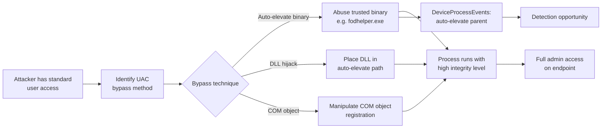
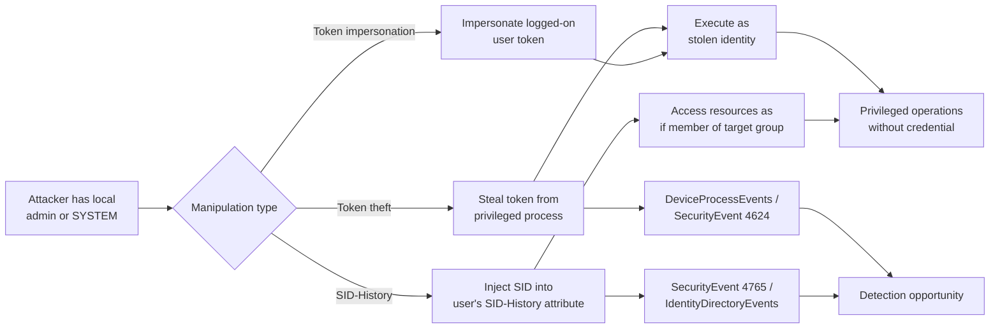
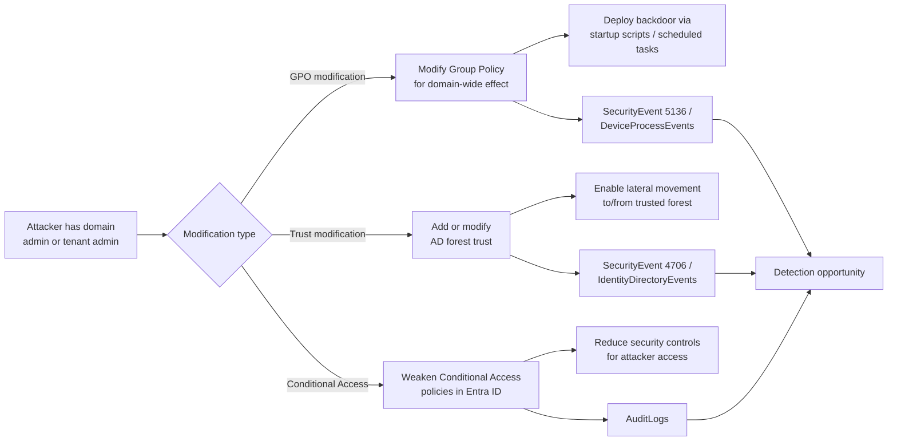

# Threat Model: Privilege Escalation (TA0004)

## Executive Summary

Privilege escalation is the attacker's transition from "I'm in" to "I own this." In Microsoft environments, this spans UAC bypasses on endpoints, access token manipulation to impersonate privileged users, and domain/group policy modification to grant broad permissions. Cloud environments add Azure RBAC escalation and Entra ID role manipulation. Detection must cover both endpoint-level escalation (process token manipulation, UAC bypass) and identity-level escalation (role assignments, policy changes).

---

## Technique: T1548 — Abuse Elevation Control Mechanism

### Sub-techniques covered
- T1548.002 — Bypass User Account Control (UAC)

### Attack Flow



### Data Sources

| MITRE Data Source | Microsoft Table | Connector Required | Notes |
|---|---|---|---|
| Process Creation | `DeviceProcessEvents` | Defender for Endpoint | Process integrity level, parent-child chain |
| Windows Registry | `DeviceRegistryEvents` | Defender for Endpoint | Registry modifications for UAC bypass |
| Command Execution | `DeviceEvents` | Defender for Endpoint | UAC bypass detection events |
| Process Creation | `SecurityEvent` | Windows Security Events | Event ID 4688 with process creation audit |

### Detection Opportunities

**Opportunity 1: Known UAC bypass via auto-elevate binaries**

```kql
// UAC bypass: auto-elevate binary spawning unexpected child
DeviceProcessEvents
| where InitiatingProcessName in~ ("fodhelper.exe", "computerdefaults.exe",
    "sdclt.exe", "eventvwr.exe", "cmstp.exe")
| where FileName !in~ ("mmc.exe", "control.exe") // Expected children
| project TimeGenerated, DeviceName, InitiatingProcessName, FileName, ProcessCommandLine
```

**Opportunity 2: Registry modification for UAC bypass**

```kql
// Registry key modification used in UAC bypass
DeviceRegistryEvents
| where ActionType == "RegistryValueSet"
| where RegistryKey has @"Software\Classes\ms-settings\shell\open\command"
    or RegistryKey has @"Software\Classes\mscfile\shell\open\command"
| project TimeGenerated, DeviceName, InitiatingProcessName, RegistryKey, RegistryValueData
```

**Opportunity 3: Process integrity level escalation**

```kql
// Process started at high integrity from medium-integrity parent
DeviceProcessEvents
| where InitiatingProcessIntegrityLevel == "Medium"
| where ProcessIntegrityLevel == "High" or ProcessIntegrityLevel == "System"
| where InitiatingProcessName !in~ ("consent.exe", "svchost.exe", "services.exe")
| project TimeGenerated, DeviceName, InitiatingProcessName, FileName, ProcessIntegrityLevel
```

### False Positive Scenarios

| Scenario | Cause | Tuning Approach |
|---|---|---|
| Legitimate UAC prompt | User approving elevation via consent.exe | Filter by consent.exe as parent; focus on bypass without consent |
| Installer packages | Installers elevating via approved mechanisms | Correlate with software deployment schedules |
| Admin tools | IT tools that auto-elevate by design | Allowlist approved admin tool hashes |

### Microsoft Product Coverage

| Product | Coverage Type | Feature | Limitations |
|---|---|---|---|
| Defender for Endpoint | Detection | UAC bypass alerts, process integrity tracking | Requires MDE agent; some novel bypass methods may evade |
| Sentinel | Detection | Custom analytics on DeviceProcessEvents | Requires custom rule development |

### Detection Gap Analysis

**Gaps:**
- **Novel UAC bypasses** — New auto-elevate binaries are discovered regularly; signature-based detection lags.
- **In-process token manipulation** — Some UAC bypasses don't create new processes; they manipulate the current process token, making process-based detection ineffective.
- **Kernel-level escalation** — Vulnerable kernel drivers can elevate without any UAC interaction, bypassing user-mode detection entirely.

**Compensating Controls:**
- Set UAC to "Always notify" (highest setting) to reduce auto-elevation surface
- Remove users from local Administrators group (eliminate the need for UAC entirely)
- Deploy Defender for Endpoint ASR rules to restrict process creation from common bypass binaries
- Enforce application control (WDAC/AppLocker) to block unauthorized executables

### Related Skills

- `skills/msft-security/defender-for-endpoint.md` — ASR rules and process protection
- `skills/detection/nrt-rule-pattern.md` — UAC bypass should be NRT detection

---

## Technique: T1134 — Access Token Manipulation

### Sub-techniques covered
- T1134.001 — Token Impersonation/Theft
- T1134.005 — SID-History Injection

### Attack Flow



### Data Sources

| MITRE Data Source | Microsoft Table | Connector Required | Notes |
|---|---|---|---|
| Process Creation | `DeviceProcessEvents` | Defender for Endpoint | Token impersonation via process manipulation |
| Logon Session | `SecurityEvent` | Windows Security Events | Event ID 4624 Type 9 (NewCredentials), 4648 (explicit creds) |
| Active Directory | `SecurityEvent` | Windows Security Events | Event ID 4765 (SID-History added) |
| Active Directory | `IdentityDirectoryEvents` | Defender for Identity | SID-History modification |

### Detection Opportunities

**Opportunity 1: Token impersonation via named pipes**

```kql
// Process impersonating another user's token
SecurityEvent
| where EventID == 4624
| where LogonType == 9 // NewCredentials (token-based logon)
| where SubjectUserName != TargetUserName // Impersonation
| where SubjectUserName != "SYSTEM"
| project TimeGenerated, Computer, SubjectUserName, TargetUserName, LogonProcessName
```

**Opportunity 2: SID-History injection**

```kql
// SID-History attribute modified
SecurityEvent
| where EventID == 4765 // SID-History was added to an account
| project TimeGenerated, Computer, SubjectUserName, TargetUserName, SidHistory
```

```kql
// Defender for Identity — SID-History modification
IdentityDirectoryEvents
| where ActionType == "Account SID-History was changed"
| project TimeGenerated, AccountName, TargetAccountName, DeviceName
```

**Opportunity 3: Make-token / steal-token patterns**

```kql
// CreateProcessWithToken or ImpersonateLoggedOnUser calls
DeviceEvents
| where ActionType in ("CreateRemoteThreadApiCall", "OpenProcessApiCall")
| where TargetProcessName in~ ("lsass.exe", "winlogon.exe", "csrss.exe")
| where InitiatingProcessName !in~ ("MsMpEng.exe", "csrss.exe", "svchost.exe")
| project TimeGenerated, DeviceName, InitiatingProcessName, ActionType, TargetProcessName
```

### False Positive Scenarios

| Scenario | Cause | Tuning Approach |
|---|---|---|
| Service account impersonation | Services running as SYSTEM impersonating users | Filter by known service names |
| SSMS / SQL impersonation | SQL Server impersonating connection context | Allowlist sqlservr.exe impersonation events |
| COM activation | COM servers impersonating calling user | Filter by known COM server processes |

### Microsoft Product Coverage

| Product | Coverage Type | Feature | Limitations |
|---|---|---|---|
| Defender for Endpoint | Detection | Token theft/impersonation alerts | Limited to known patterns; novel tools may evade |
| Defender for Identity | Detection | SID-History injection alert | Requires DC sensor |
| Sentinel | Detection | Custom analytics on SecurityEvent | Requires event IDs 4624/4648/4765 enabled |

### Detection Gap Analysis

**Gaps:**
- **In-process token manipulation** — Manipulation within the same process (e.g., AdjustTokenPrivileges) may not generate security events.
- **Token material in memory** — Stolen token handles don't always result in new logon sessions, making event-based detection incomplete.
- **SID-History across trusts** — SID-History attacks targeting trusted forests may bypass local AD detection if trust filtering (SID filtering) is disabled.

**Compensating Controls:**
- Enable SID filtering on all forest trusts
- Restrict SeImpersonatePrivilege to necessary service accounts only
- Deploy Credential Guard to protect token material
- Monitor for users with SID-History attribute (should be empty in most environments)

### Related Skills

- `skills/msft-security/defender-for-identity.md` — SID-History attack detection
- `skills/msft-security/defender-for-endpoint.md` — Token manipulation detection

---

## Technique: T1484 — Domain or Tenant Policy Modification

### Sub-techniques covered
- T1484.002 — Trust Modification

### Attack Flow



### Data Sources

| MITRE Data Source | Microsoft Table | Connector Required | Notes |
|---|---|---|---|
| Active Directory | `SecurityEvent` | Windows Security Events | Event ID 5136 (directory object modified), 4706 (trust created) |
| Active Directory | `IdentityDirectoryEvents` | Defender for Identity | GPO and trust changes |
| User Account | `AuditLogs` | Entra ID connector | Conditional Access policy changes |
| Cloud Service | `AzureActivity` | Azure Activity connector | Azure Policy modifications |

### Detection Opportunities

**Opportunity 1: Group Policy modification**

```kql
// GPO modified — especially sensitive GPOs
SecurityEvent
| where EventID == 5136
| where ObjectClass == "groupPolicyContainer"
| extend ModifiedAttribute = tostring(AttributeLDAPDisplayName)
| project TimeGenerated, Computer, SubjectUserName, ObjectDN, ModifiedAttribute
```

**Opportunity 2: AD trust creation or modification**

```kql
// New trust created or existing trust modified
SecurityEvent
| where EventID in (4706, 4707, 4716) // Trust created, removed, modified
| project TimeGenerated, Computer, SubjectUserName, TrustType, TrustDirection, TrustedDomain
```

**Opportunity 3: Conditional Access policy weakened**

```kql
// Conditional Access policy updated — check for weakening
AuditLogs
| where OperationName in ("Update conditional access policy", "Delete conditional access policy")
| extend PolicyName = tostring(TargetResources[0].displayName)
| extend ModifiedBy = tostring(InitiatedBy.user.userPrincipalName)
| project TimeGenerated, ModifiedBy, PolicyName, OperationName
```

**Opportunity 4: Azure RBAC owner/contributor added at subscription scope**

```kql
// Subscription-level role assignment (Owner or Contributor)
AzureActivity
| where OperationNameValue == "Microsoft.Authorization/roleAssignments/write"
| where ActivityStatusValue == "Success"
| extend RoleDefinitionId = tostring(parse_json(Properties).requestbody)
| where RoleDefinitionId has "8e3af657-a8ff-443c-a75c-2fe8c4bcb635" // Owner
    or RoleDefinitionId has "b24988ac-6180-42a0-ab88-20f7382dd24c" // Contributor
| project TimeGenerated, Caller, ResourceGroup, RoleDefinitionId
```

### False Positive Scenarios

| Scenario | Cause | Tuning Approach |
|---|---|---|
| Planned GPO changes | IT team modifying GPOs for policy enforcement | Correlate with change management tickets; time-bound suppression |
| Security team tuning CA policies | Adjusting Conditional Access during rollout | Require admin justification in audit trail |
| Trust for M&A activity | Creating trusts during mergers/acquisitions | Treat as high-priority event requiring executive approval |

### Microsoft Product Coverage

| Product | Coverage Type | Feature | Limitations |
|---|---|---|---|
| Defender for Identity | Detection | GPO modification alerts, trust anomalies | Requires DC sensor |
| Sentinel | Detection | Custom analytics on SecurityEvent / AuditLogs | Requires custom development |
| Entra ID | Audit | Conditional Access audit logs | Logging only — no native alerting on weakening |
| Defender for Cloud | Detection | Azure RBAC changes at subscription level | Limited to Azure management plane |

### Detection Gap Analysis

**Gaps:**
- **Subtle GPO changes** — Modifying an existing GPO to add one startup script among many legitimate ones is very hard to catch without full GPO version diffing.
- **Conditional Access bypass** — If an attacker creates a *new* CA policy with exclusions rather than modifying an existing one, the "update" detection misses it.
- **Cross-forest trust abuse** — If trust is already established, abusing it for lateral movement doesn't generate trust modification events.

**Compensating Controls:**
- Implement GPO version control (backup and diff GPOs on a schedule)
- Require PIM activation for all Conditional Access changes
- Enable SID filtering on all external trusts
- Alert on any Conditional Access policy deletion or creation (not just updates)
- Use Azure Policy to restrict role assignments at management group scope

### Related Skills

- `skills/msft-security/defender-for-identity.md` — GPO and trust modification detection
- `skills/msft-security/entra-id-protection.md` — Conditional Access policy monitoring
- `skills/msft-security/defender-for-cloud-policies.md` — Azure Policy for RBAC governance

---

## Coverage Matrix

| Technique ID | Technique Name | Detection Rule | Data Source Available | Coverage Level | Notes |
|---|---|---|---|---|---|
| T1548.002 | UAC Bypass | MDE + Sentinel | ✅ DeviceProcessEvents | Partial | Novel bypasses may evade; kernel-level escapes not covered |
| T1134.001 | Token Impersonation/Theft | MDE + Sentinel | ✅ SecurityEvent 4624, DeviceEvents | Partial | In-process manipulation hard to detect |
| T1134.005 | SID-History Injection | Defender for Identity + Sentinel | ✅ SecurityEvent 4765 | Full | High-fidelity alert; SID-History changes are rare and suspicious |
| T1484.002 | Trust Modification | Defender for Identity + Sentinel | ✅ SecurityEvent 4706/4716 | Full | Trust changes are rare; every one should be investigated |

### Coverage Summary

- **Full coverage:** 2 techniques (SID-History Injection, Trust Modification)
- **Partial coverage:** 2 techniques (UAC Bypass, Token Impersonation)
- **No coverage:** 0 techniques
- **Highest priority gap:** T1548.002 (UAC Bypass) — The constant discovery of new auto-elevate binaries and kernel-level escalation techniques makes this a moving target requiring continuous rule updates.

---

## References

- [MITRE ATT&CK — Privilege Escalation](https://attack.mitre.org/tactics/TA0004/)
- [UAC bypass techniques — UACMe project](https://github.com/hfiref0x/UACME)
- [Microsoft token protection documentation](https://learn.microsoft.com/en-us/entra/identity/conditional-access/concept-token-protection)

---

## Revision History

| Date | Version | Author | Changes |
|---|---|---|---|
| 2026-04-28 | 1.0 | Kima | Initial threat model — privilege escalation tactic |
