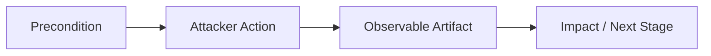

# Threat Model: {Tactic Name}

## Executive Summary

<!-- One paragraph: What does this tactic represent? Why does it matter for your environment? What's the blast radius if undetected? -->

{Describe the tactic, its relevance to your environment, and the risk of undetected attacks using techniques in this tactic.}

---

## Technique: T1XXX — {Technique Name}

### Attack Flow

<!-- Mermaid diagram showing the end-to-end attack chain for this technique. Include initial conditions, actions, observable artifacts, and outcomes. -->



### Data Sources

<!-- List the specific log tables and data types needed to detect this technique. Include both the MITRE data source name and the specific Microsoft table. -->

| MITRE Data Source | Microsoft Table | Connector Required | Notes |
|---|---|---|---|
| {Data Source Name} | `{TableName}` | {Connector} | {Collection requirements} |

### Detection Opportunities

<!-- Where in the attack chain can you detect? For each opportunity, provide context and a KQL query stub. -->

**Opportunity 1: {Description}**

Detection point in the attack chain: {Where}

```kql
// {Description of what this query detects}
// Stub — implement full logic based on your environment
{TableName}
| where {FilterCondition}
| {TransformationLogic}
```

**Opportunity 2: {Description}**

```kql
// {Description}
{TableName}
| where {FilterCondition}
```

### False Positive Scenarios

<!-- Document known false positive patterns and how to tune them out. -->

| Scenario | Cause | Tuning Approach |
|---|---|---|
| {FP Scenario} | {Root cause} | {How to filter or suppress} |

### Microsoft Product Coverage

<!-- Which Microsoft Security products provide native detection or protection for this technique? -->

| Product | Coverage Type | Feature | Limitations |
|---|---|---|---|
| {Product Name} | Detection / Prevention / Both | {Specific feature} | {What it misses} |

### Detection Gap Analysis

<!-- What can your current product stack NOT detect about this technique? What compensating controls exist? -->

**Gaps:**
- {Gap 1: Describe what cannot be detected and why}
- {Gap 2: Describe another blind spot}

**Compensating Controls:**
- {Control 1: What alternative measure addresses the gap}
- {Control 2: Another compensating approach}

### Related Skills

<!-- Cross-reference relevant skills from the secops-squad library -->

- `skills/detection/{relevant-skill}.md` — {Why it's relevant}
- `skills/msft-security/{relevant-skill}.md` — {Why it's relevant}
- `skills/kql/{relevant-skill}.md` — {Why it's relevant}

---

<!-- Copy the entire "## Technique" section above for each additional technique in this tactic -->

## Technique: T1XXX.XXX — {Sub-Technique Name}

<!-- Repeat the same structure: Attack Flow, Data Sources, Detection Opportunities, False Positives, Product Coverage, Gap Analysis, Related Skills -->

---

## Coverage Matrix

<!-- Summary table showing detection status across all techniques in this model -->

| Technique ID | Technique Name | Detection Rule | Data Source Available | Coverage Level | Notes |
|---|---|---|---|---|---|
| T1XXX | {Name} | {Rule name or "None"} | ✅ / ❌ | Full / Partial / None | {Notes} |
| T1XXX.XXX | {Name} | {Rule name or "None"} | ✅ / ❌ | Full / Partial / None | {Notes} |

### Coverage Summary

- **Full coverage:** {X} techniques
- **Partial coverage:** {X} techniques
- **No coverage:** {X} techniques
- **Highest priority gap:** {Technique} — {Why it matters}

---

## References

- [MITRE ATT&CK — {Tactic Name}](https://attack.mitre.org/tactics/{TA00XX}/)
- [Microsoft Security documentation]({relevant URL})
- {Additional threat intelligence references}

---

## Revision History

| Date | Version | Author | Changes |
|---|---|---|---|
| 2026-04-28 | 1.0 | {Author} | Initial threat model |
